# Работа №1: Исследование диодов

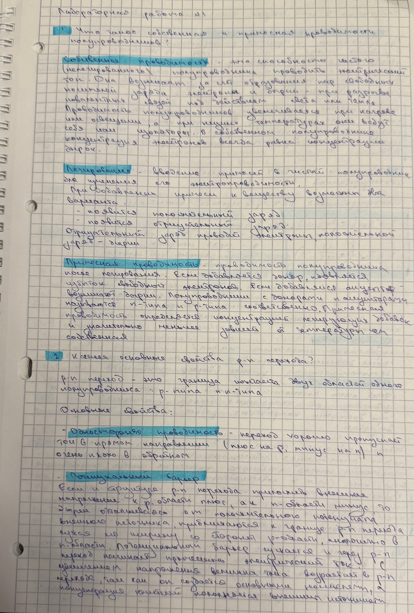
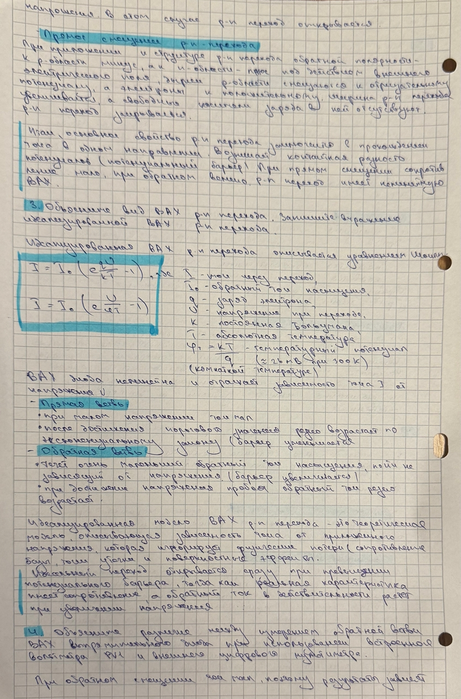
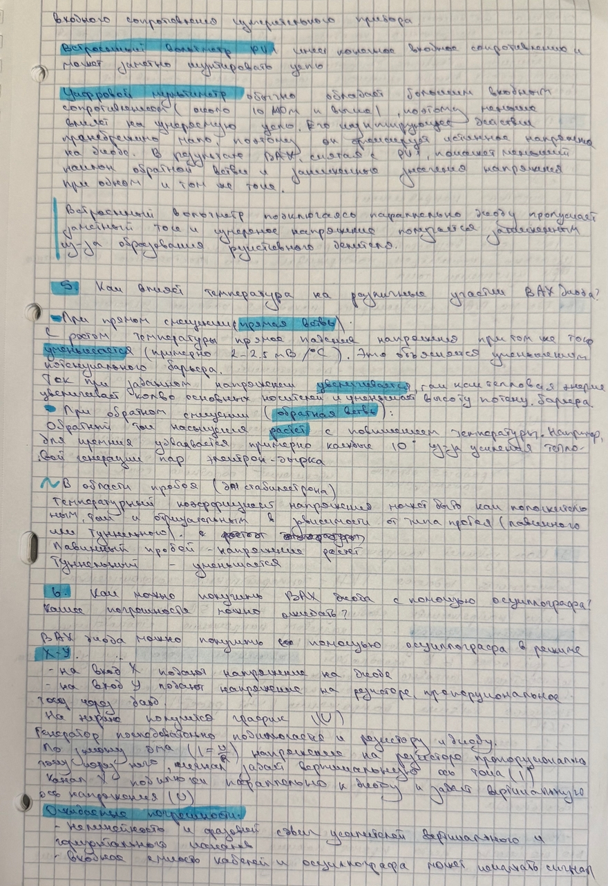
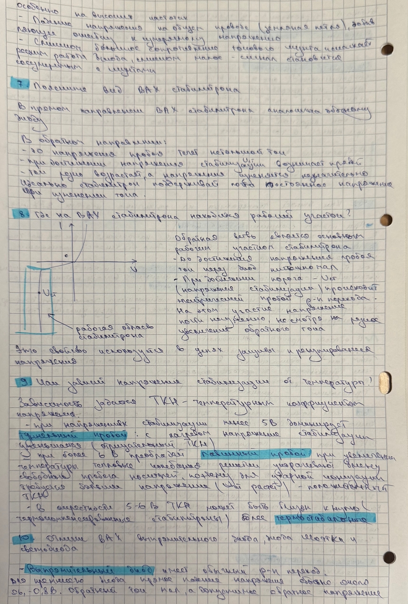
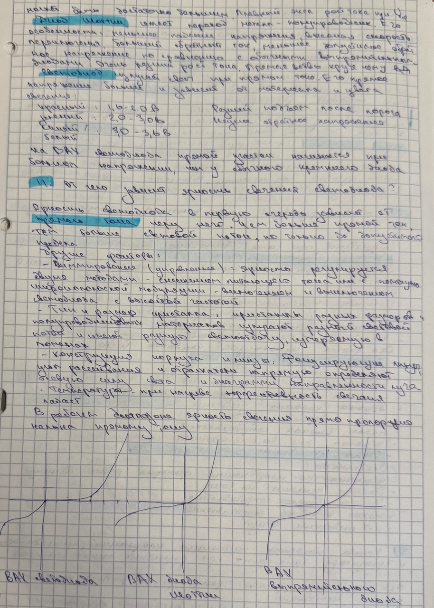

---

## Цель работы

Изучение статических вольт-амперных характеристик и основных параметров полупроводниковых диодов: выпрямительного диода, диода Шоттки, стабилитрона и светодиода.

---

# 1. Статические вольт-амперные характеристики диодов

## 1.1. Прямая ветвь ВАХ

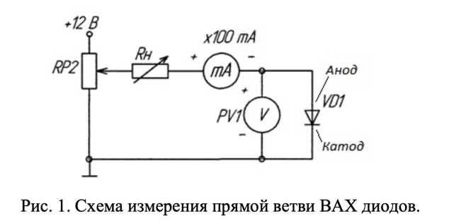

---

## VD1 — выпрямительный диод

| № измерения | Анодное напряжение $U_a$, В | Анодный ток $I_a$, мА |
|:--:|:--:|:--:|
| 1 | 0 | 0 |
| 2 | 0.68 | 10.0 |
| 3 | 0.70 | 12.0 |
| 4 | 0.74 | 26.0 |
| 5 | 0.76 | 40.0 |
| 6 | 0.77 | 52.0 |
| 7 | 0.78 | 62.0 |
| 8 | 0.79 | 80.0 |
| 9 | 0.80 | 94.0 |

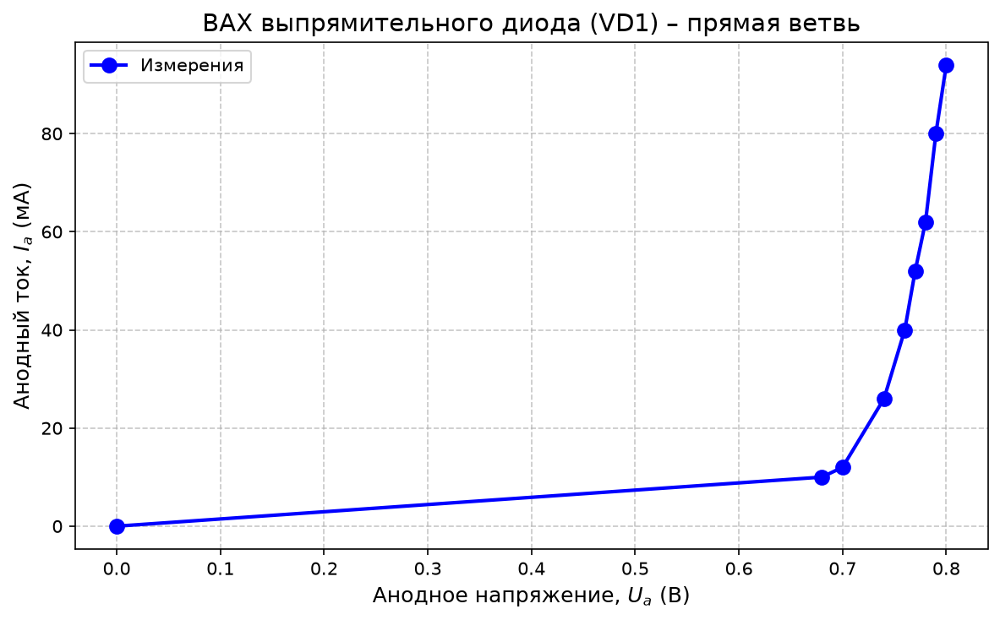

По полученной характеристике видно, что выпрямительный диод начинает заметно проводить ток при напряжении около $0.68\text{–}0.70$ В, что соответствует типичному поведению кремниевого p-n-перехода.

---

## VD2 — диод Шоттки

| № измерения | Анодное напряжение $U_a$, В | Анодный ток $I_a$, мА |
|:--:|:--:|:--:|
| 1 | 0 | 0 |
| 2 | 0.25 | 8.0 |
| 3 | 0.27 | 14.0 |
| 4 | 0.29 | 24.0 |
| 5 | 0.30 | 32.0 |
| 6 | 0.31 | 50.0 |
| 7 | 0.32 | 60.0 |
| 8 | 0.33 | 80.0 |
| 9 | 0.34 | 100.0 |

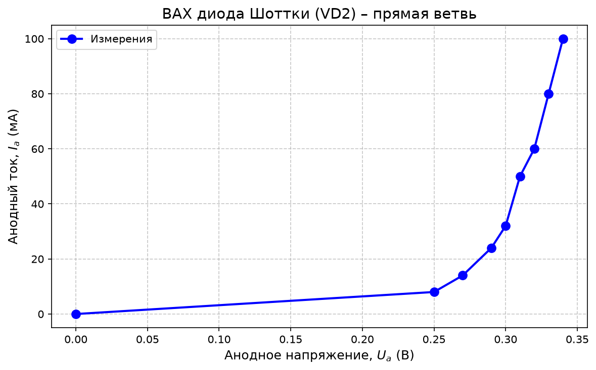

Диод Шоттки открывается при меньшем прямом напряжении, чем обычный кремниевый выпрямительный диод. Это связано с тем, что в диоде Шоттки используется переход металл–полупроводник, а не обычный p-n-переход.

---

## VD3 — светодиод

| № измерения | Анодное напряжение $U_a$, В | Анодный ток $I_a$, мА |
|:--:|:--:|:--:|
| 1 | 0 | 0 |
| 2 | 1.97 | 4.0 |
| 3 | 2.04 | 10.0 |
| 4 | 2.13 | 16.0 |
| 5 | 2.17 | 20.0 |
| 6 | 2.89 | 50.0 |

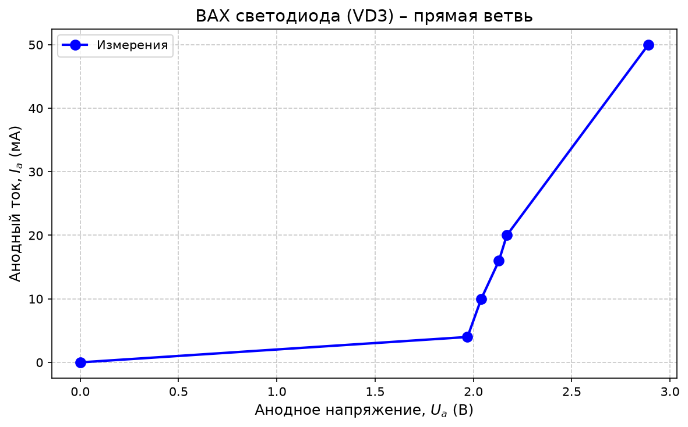

Светодиод имеет большее прямое напряжение по сравнению с выпрямительным диодом и диодом Шоттки. При протекании прямого тока через светодиод наблюдается свечение.

---

## VD4 — стабилитрон, прямая ветвь

| № измерения | Анодное напряжение $U_a$, В | Анодный ток $I_a$, мА |
|:--:|:--:|:--:|
| 1 | 0 | 0 |
| 2 | 0.74 | 2.0 |
| 3 | 0.80 | 10.0 |
| 4 | 0.82 | 16.0 |
| 5 | 0.84 | 20.0 |
| 6 | 0.85 | 36.0 |
| 7 | 0.86 | 46.0 |
| 8 | 0.87 | 50.0 |

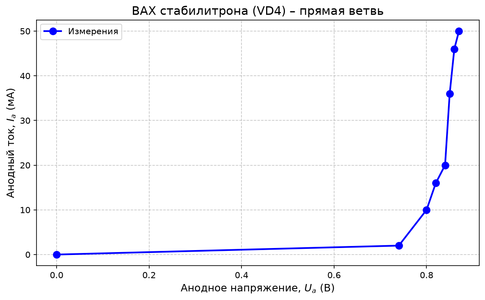

В прямом направлении стабилитрон ведёт себя как обычный кремниевый диод: при напряжении порядка $0.7\text{–}0.8$ В ток начинает резко возрастать.

---

# 1.2. Обратная ветвь ВАХ

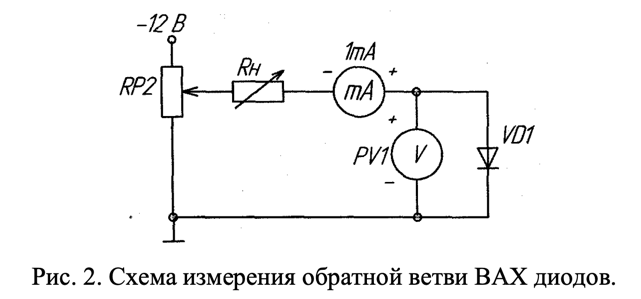

---

## VD1 — выпрямительный диод, обратная ветвь

| № измерения | Обратное напряжение $U_{\text{обр}}$, В | Обратный ток $I_{\text{обр}}$, мА |
|:--:|:--:|:--:|
| 1 | 0 | 0 |
| 2 | 0.1 | 2.8 |
| 3 | 0.2 | 5.9 |
| 4 | 0.3 | 9.13 |
| 5 | 0.4 | 11.6 |

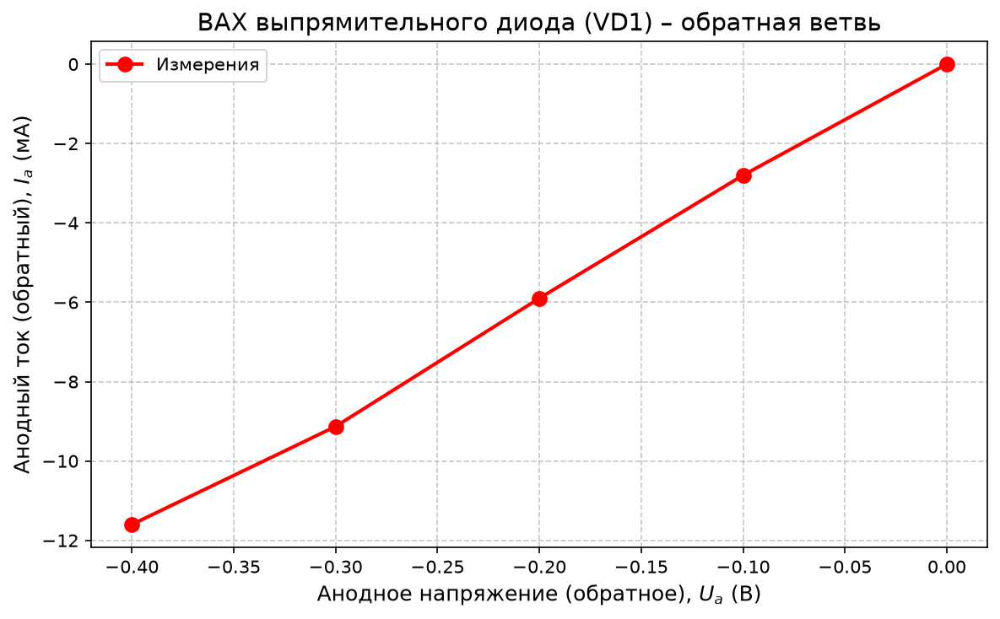

По обратной ветви ВАХ видно, что при увеличении обратного напряжения изменяется обратный ток диода. В исследованном диапазоне напряжений пробой выпрямительного диода не наблюдался.

---

## VD4 — стабилитрон, обратная ветвь

| № измерения | Обратное напряжение $U_{\text{обр}}$, В | Обратный ток $I_{\text{обр}}$, мА |
|:--:|:--:|:--:|
| 1 | 0 | 0 |
| 2 | 0.10 | 2.90 |
| 3 | 0.90 | 6.99 |
| 4 | 6.00 | 7.09 |
| 5 | 7.16 | 10.00 |
| 6 | 7.25 | 20.00 |

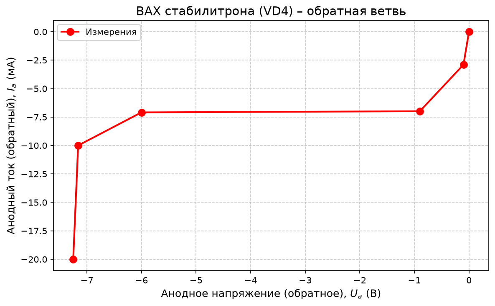

На обратной ветви ВАХ стабилитрона наблюдается резкое увеличение тока после достижения напряжения стабилизации. Это соответствует переходу стабилитрона в область обратного электрического пробоя.

---

# 2. Определение параметров диодов

## 2.1. VD1 — выпрямительный диод

### Прямая ветвь

Максимальное измеренное прямое напряжение:

$$
U_{a \max}=0.80 \text{ В}
$$

при токе:

$$
I_{a \max}=94 \text{ мА}
$$

Пороговое напряжение, соответствующее началу заметного роста тока:

$$
U_0 \approx 0.68 \text{ В}
$$

Дифференциальное сопротивление открытого диода определим по участку $0.79\text{–}0.80$ В:

$$
r_{\text{диф}}=\frac{\Delta U}{\Delta I}
$$

$$
r_{\text{диф}}=
\frac{0.80-0.79}{0.094-0.080}
=
\frac{0.01}{0.014}
\approx 0.71 \ \Omega
$$

Итак:

$$
r_{\text{диф}} \approx 0.71 \ \Omega
$$

### Обратная ветвь

Для обратной ветви выпрямительного диода были получены значения обратного тока при различных значениях обратного напряжения. В исследованном диапазоне напряжений участок обратного пробоя не наблюдался.

Максимальное исследованное обратное напряжение:

$$
U_{\text{обр max}} = 0.4 \text{ В}
$$

Соответствующий обратный ток:

$$
I_{\text{обр}} = 11.6 \text{ мА}
$$

---

## 2.2. VD2 — диод Шоттки

Максимальное измеренное прямое напряжение:

$$
U_{a \max}=0.34 \text{ В}
$$

при токе:

$$
I_{a \max}=100 \text{ мА}
$$

Пороговое напряжение:

$$
U_0 \approx 0.25 \text{ В}
$$

Дифференциальное сопротивление определим по участку $0.33\text{–}0.34$ В:

$$
r_{\text{диф}}=
\frac{0.34-0.33}{0.100-0.080}
$$

$$
r_{\text{диф}}=
\frac{0.01}{0.020}
=0.50 \ \Omega
$$

Итак:

$$
r_{\text{диф}} \approx 0.50 \ \Omega
$$

Диод Шоттки имеет меньшее прямое падение напряжения по сравнению с выпрямительным диодом:

$$
0.25 \text{ В} < 0.68 \text{ В}
$$

Это является его основным преимуществом в низковольтных схемах.

---

## 2.3. VD3 — светодиод

Максимальное измеренное прямое напряжение:

$$
U_{a \max}=2.89 \text{ В}
$$

при токе:

$$
I_{a \max}=50 \text{ мА}
$$

Пороговое напряжение:

$$
U_0 \approx 1.97 \text{ В}
$$

Минимальный ток видимого свечения, определённый визуально:

$$
I_{\text{св min}} \approx 2 \text{ мА}
$$

Дифференциальное сопротивление определим по участку от $2.13$ В до $2.17$ В:

$$
r_{\text{диф}}=
\frac{2.17-2.13}{0.020-0.016}
$$

$$
r_{\text{диф}}=
\frac{0.04}{0.004}
=10 \ \Omega
$$

Итак:

$$
r_{\text{диф}} \approx 10 \ \Omega
$$

Светодиод имеет наибольшее прямое напряжение среди исследованных диодов, что связано с особенностями материала полупроводника и излучательной рекомбинацией носителей заряда.

---

## 2.4. VD4 — стабилитрон

### Прямая ветвь

Максимальное измеренное прямое напряжение:

$$
U_{a \max}=0.87 \text{ В}
$$

при токе:

$$
I_{a \max}=50 \text{ мА}
$$

Пороговое напряжение:

$$
U_0 \approx 0.74 \text{ В}
$$

Дифференциальное сопротивление на участке $0.86\text{–}0.87$ В:

$$
r_{\text{диф}}=
\frac{0.87-0.86}{0.050-0.046}
$$

$$
r_{\text{диф}}=
\frac{0.01}{0.004}
=2.5 \ \Omega
$$

Итак:

$$
r_{\text{диф}} \approx 2.5 \ \Omega
$$

В прямом направлении стабилитрон работает как обычный кремниевый диод.

---

### Обратная ветвь

По экспериментальным данным напряжение стабилизации можно оценить как:

$$
U_{\text{ст}} \approx 7.0\text{–}7.25 \text{ В}
$$

Дифференциальное сопротивление в области стабилизации определим по точкам:

$$
U_1=6.00 \text{ В}, \quad I_1=7.09 \text{ мА}
$$

$$
U_2=7.25 \text{ В}, \quad I_2=20.00 \text{ мА}
$$

Тогда:

$$
r_{\text{д ст}}=
\frac{U_2-U_1}{I_2-I_1}
$$

$$
r_{\text{д ст}}=
\frac{7.25-6.00}{0.02000-0.00709}
$$

$$
r_{\text{д ст}}=
\frac{1.25}{0.01291}
\approx 96.8 \ \Omega
$$

Итак:

$$
r_{\text{д ст}} \approx 97 \ \Omega
$$

Полученное значение характеризует наклон обратной ветви ВАХ стабилитрона на выбранном участке стабилизации.

---

# 3. Осциллографические измерения

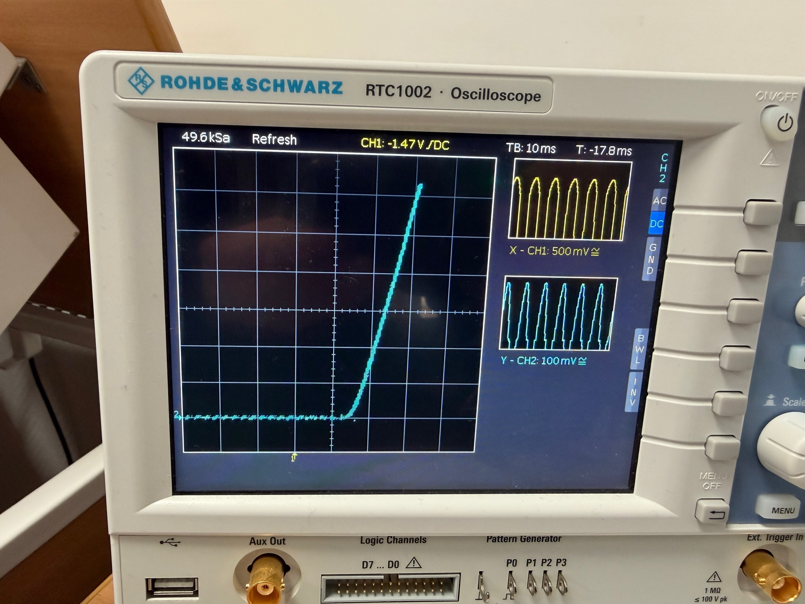

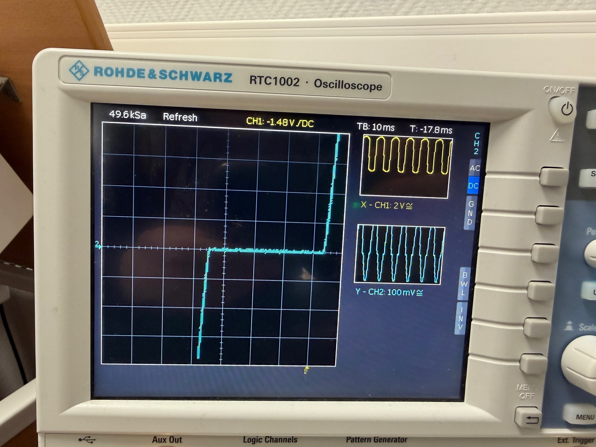

При осциллографическом измерении ВАХ диода используется режим $X/Y$. По оси $X$ откладывается напряжение на диоде, а по оси $Y$ — напряжение на измерительном резисторе, пропорциональное току через диод.

Ток через диод определяется по формуле:

$$
I_D=\frac{U_R}{R}
$$

где:

- $U_R$ — напряжение на измерительном резисторе;
- $R$ — сопротивление измерительного резистора.

По осциллограммам можно определить форму ВАХ исследуемых диодов, пороговое напряжение, область резкого роста прямого тока и участок стабилизации у стабилитрона.

---

# 4. Сводная таблица параметров

| Диод | Тип диода | $U_0$, В | $I_{\max}$, мА | $U_{\max}$, В | $r_{\text{диф}}$, Ом | Особенность |
|:--:|:--|:--:|:--:|:--:|:--:|:--|
| VD1 | Выпрямительный | 0.68 | 94 | 0.80 | 0.71 | Обычный кремниевый p-n-переход |
| VD2 | Шоттки | 0.25 | 100 | 0.34 | 0.50 | Малое прямое падение напряжения |
| VD3 | Светодиод | 1.97 | 50 | 2.89 | 10 | Излучает свет при прямом токе |
| VD4 | Стабилитрон, прямая ветвь | 0.74 | 50 | 0.87 | 2.5 | В прямом направлении как обычный диод |
| VD4 | Стабилитрон, обратная ветвь | — | 20 | 7.25 | 97 | Стабилизация около $7.0\text{–}7.25$ В |

---

# 5. Вывод

В ходе лабораторной работы были исследованы статические вольт-амперные характеристики выпрямительного диода, диода Шоттки, светодиода и стабилитрона.

1. **Выпрямительный диод VD1** в прямом направлении начинает заметно проводить ток при напряжении около $0.68$ В. Его дифференциальное сопротивление на выбранном участке составило примерно:

$$
r_{\text{диф}} \approx 0.71 \ \Omega
$$

Это соответствует поведению обычного кремниевого p-n-перехода. В обратном направлении в исследованном диапазоне напряжений участок пробоя не наблюдался.

2. **Диод Шоттки VD2** имеет значительно меньшее прямое напряжение открытия:

$$
U_0 \approx 0.25 \text{ В}
$$

Его дифференциальное сопротивление составило:

$$
r_{\text{диф}} \approx 0.50 \ \Omega
$$

Это подтверждает, что диод Шоттки обладает меньшим прямым падением напряжения по сравнению с обычным выпрямительным диодом.

3. **Светодиод VD3** начинает проводить ток и излучать свет при напряжении около $1.9\text{–}2.0$ В. Минимальный ток видимого свечения составил примерно:

$$
I_{\text{св min}} \approx 2 \text{ мА}
$$

Дифференциальное сопротивление светодиода на выбранном участке равно:

$$
r_{\text{диф}} \approx 10 \ \Omega
$$

4. **Стабилитрон VD4** в прямом направлении работает как обычный кремниевый диод с пороговым напряжением около:

$$
U_0 \approx 0.74 \text{ В}
$$

В обратном направлении наблюдается переход в область пробоя. Напряжение стабилизации по экспериментальным данным можно оценить как:

$$
U_{\text{ст}} \approx 7.0\text{–}7.25 \text{ В}
$$

Дифференциальное сопротивление на участке стабилизации составило примерно:

$$
r_{\text{д ст}} \approx 97 \ \Omega
$$
