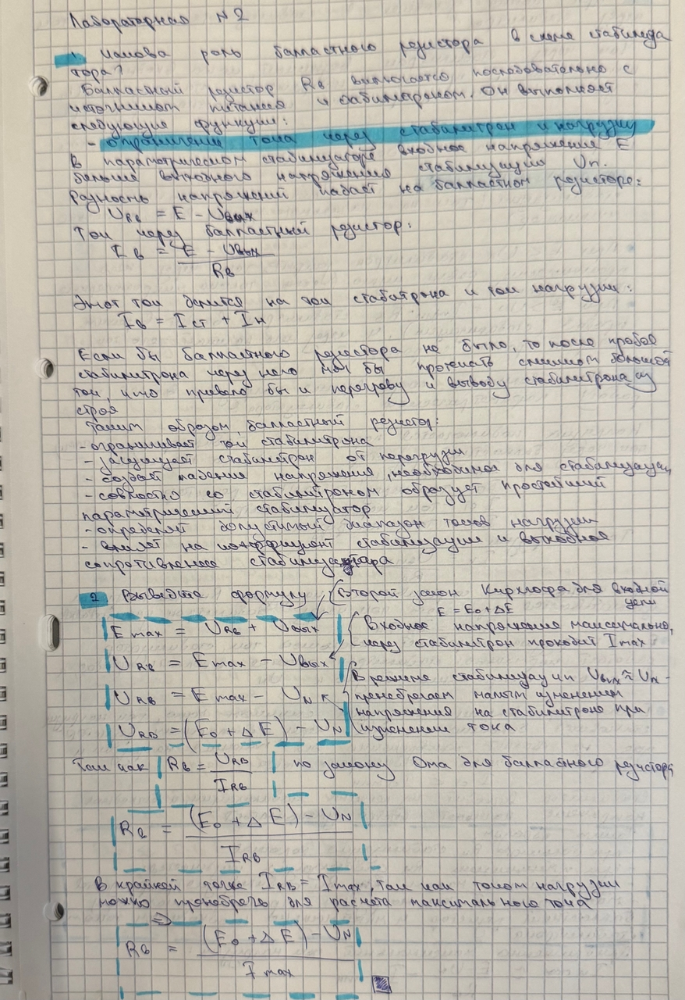
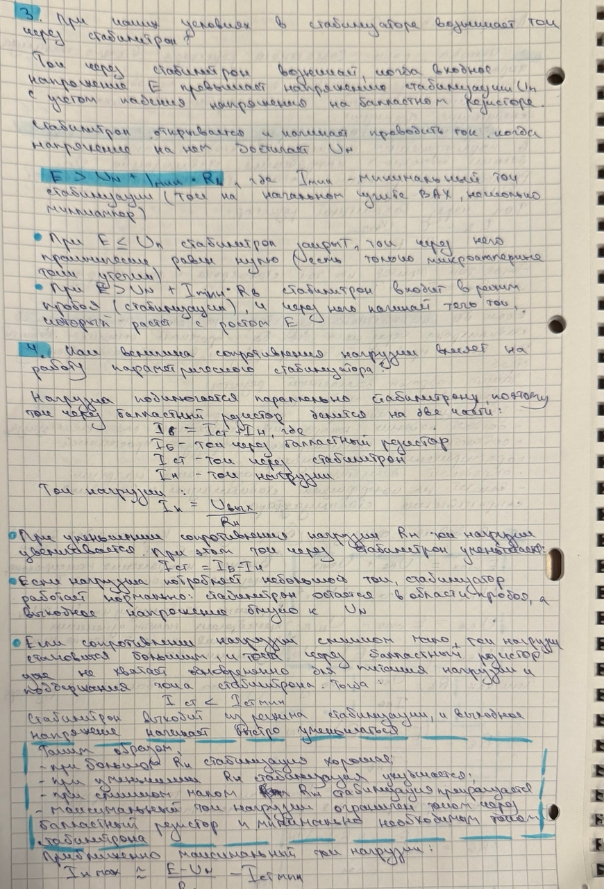
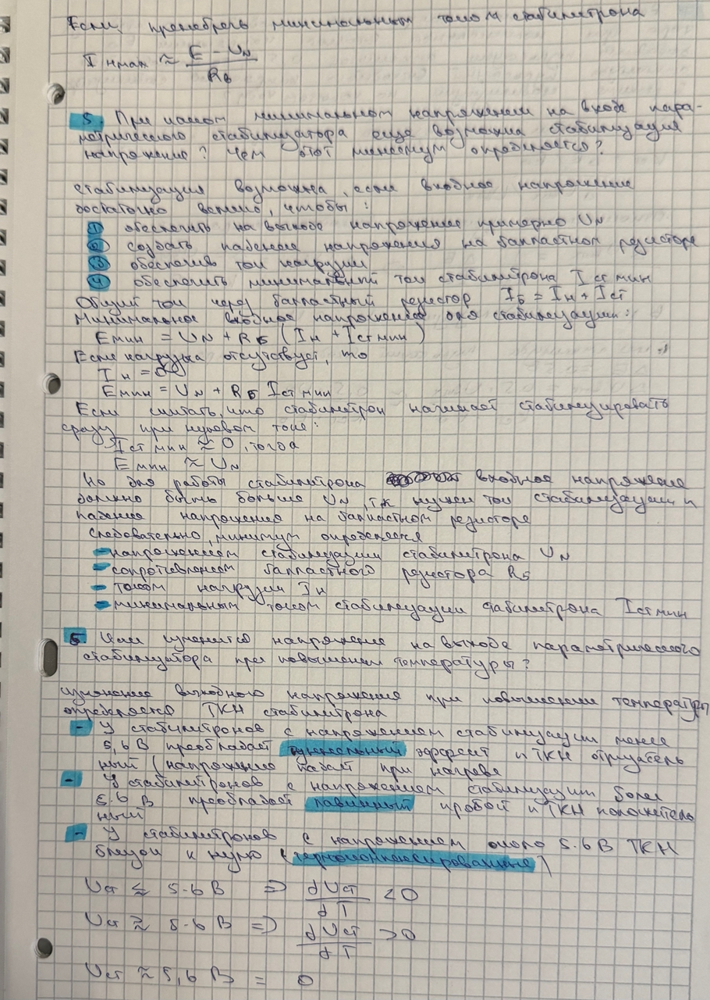
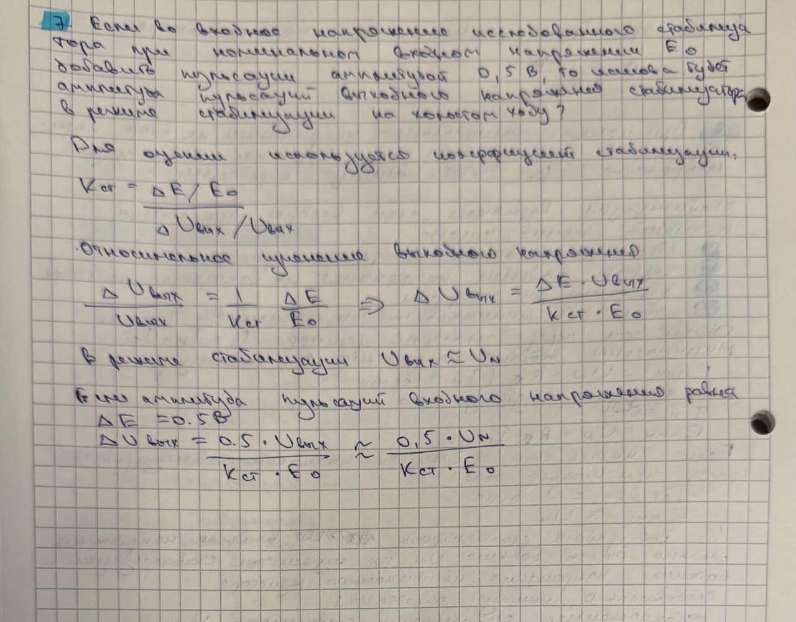
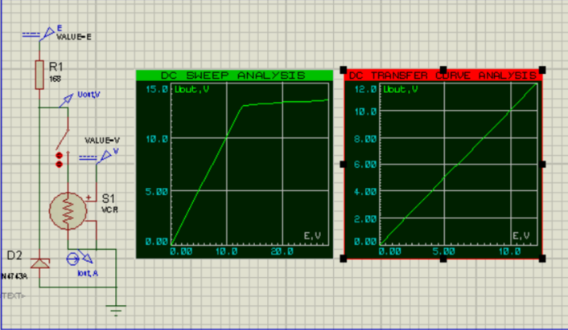
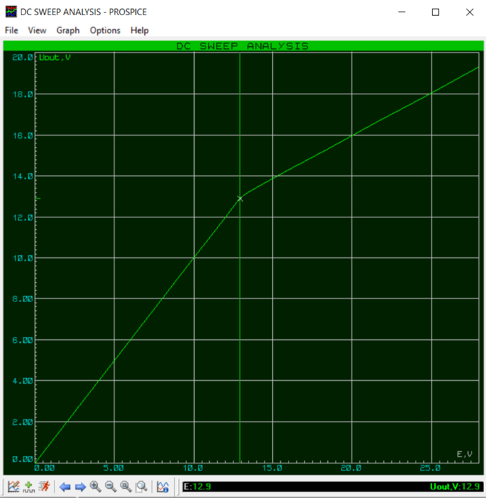
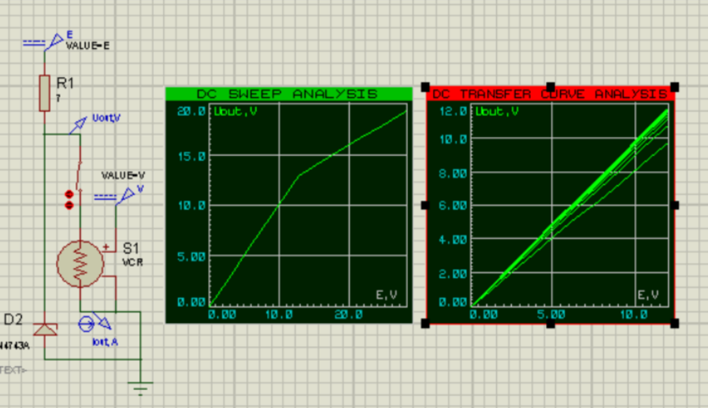
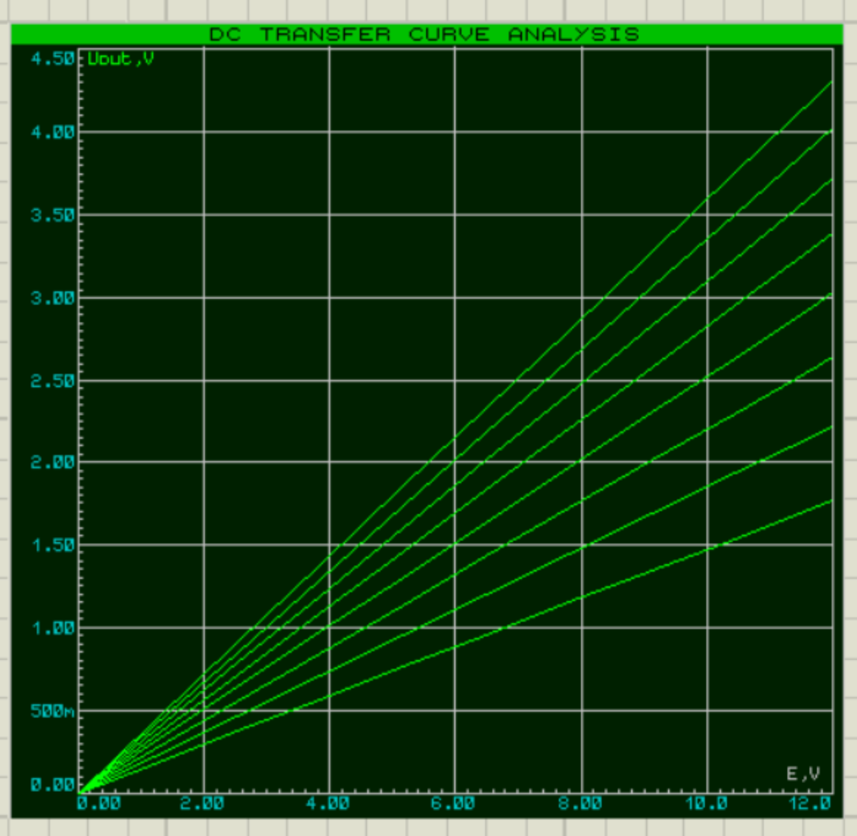

# Исследование параметрического стабилизатора

---
Цель исследования — получить передаточные и нагрузочные характеристики параметрического стабилизатора, а также оценить влияние изменения напряжения питания и сопротивления нагрузки на выходное напряжение.

---

# 1. Передаточные характеристики

## 1.0 Подготовка

Перед началом моделирования были рассчитаны параметры схемы. Исследование проводилось при изменении входного напряжения в диапазоне

$$
E = 0 \ldots 26\text{ В}.
$$

Балластный резистор выбран равным

$$
R_b = 168~\Omega.
$$

---

## 1.1 Снятие передаточной характеристики стабилизатора в режиме холостого хода

На графике представлена зависимость выходного напряжения стабилизатора от напряжения питания при отсутствии нагрузки.

При малых значениях входного напряжения стабилитрон закрыт, поэтому выходное напряжение практически совпадает с входным. После достижения напряжения стабилизации (около **13 В**) стабилитрон переходит в режим обратного пробоя, вследствие чего дальнейшее увеличение входного напряжения практически не изменяет выходное напряжение.

По графику можно определить напряжение стабилизации

$$
U_{\text{ст}} \approx 12.9\text{ В}.
$$

---

## 1.2 Снятие передаточных характеристик при различных сопротивлениях нагрузки

Получено семейство передаточных характеристик при различных сопротивлениях нагрузки.

При увеличении нагрузки возрастает ток, потребляемый нагрузкой, вследствие чего часть тока перестаёт протекать через стабилитрон. Это приводит к небольшому уменьшению выходного напряжения и ухудшению качества стабилизации.

При больших сопротивлениях нагрузки характеристики практически совпадают, что свидетельствует о нормальной работе стабилизатора.

---

# 2. Нагрузочные характеристики

## 2.0 Подготовка

Исследование выполнялось при номинальном напряжении питания

$$
E = 20\text{ В}.
$$

Во время моделирования изменялось сопротивление нагрузки, что позволило исследовать изменение выходного напряжения и тока нагрузки.

---

## 2.1 Снятие нагрузочных характеристик

На графике представлены нагрузочные характеристики стабилизатора.

С уменьшением сопротивления нагрузки возрастает ток нагрузки, вследствие чего выходное напряжение постепенно снижается. Пока ток стабилитрона остаётся достаточным для работы в режиме стабилизации, изменение выходного напряжения незначительно. При дальнейшем увеличении нагрузки качество стабилизации ухудшается.

---

# 3. Обработка результатов

## 3.1 Определение коэффициента стабилизации

Коэффициент стабилизации определяется по формуле

$$
K_{\text{ст}}=\frac{\Delta E}{\Delta U_{\text{вых}}}.
$$

По полученной характеристике напряжение стабилизации составляет примерно

$$
U_{\text{ст}}\approx12.9\text{ В}.
$$

---

## 3.2 Определение максимальной мощности нагрузки

Максимальная мощность определяется по графику зависимости

$$
P=f(R_{\text{н}}).
$$

Она достигается при некотором промежуточном значении сопротивления нагрузки, когда одновременно обеспечиваются достаточно большие ток и напряжение.

---

## 3.3 Построение выходной характеристики

По результатам моделирования построена зависимость

$$
U_{\text{вых}}=f(I_{\text{вых}}).
$$

Выходная характеристика показывает изменение выходного напряжения при изменении тока нагрузки.

В рабочем диапазоне зависимость близка к линейной. По мере увеличения тока нагрузки выходное напряжение начинает уменьшаться, что связано с ограниченными возможностями параметрического стабилизатора поддерживать постоянное напряжение.

---

## 3.4 Определение выходного дифференциального сопротивления

Выходное дифференциальное сопротивление определяется по наклону выходной характеристики

$$
r_{\text{вых}}=\frac{\Delta U_{\text{вых}}}{\Delta I_{\text{вых}}}.
$$

Чем меньше величина выходного сопротивления, тем выше качество стабилизации и меньше изменение выходного напряжения при изменении нагрузки.