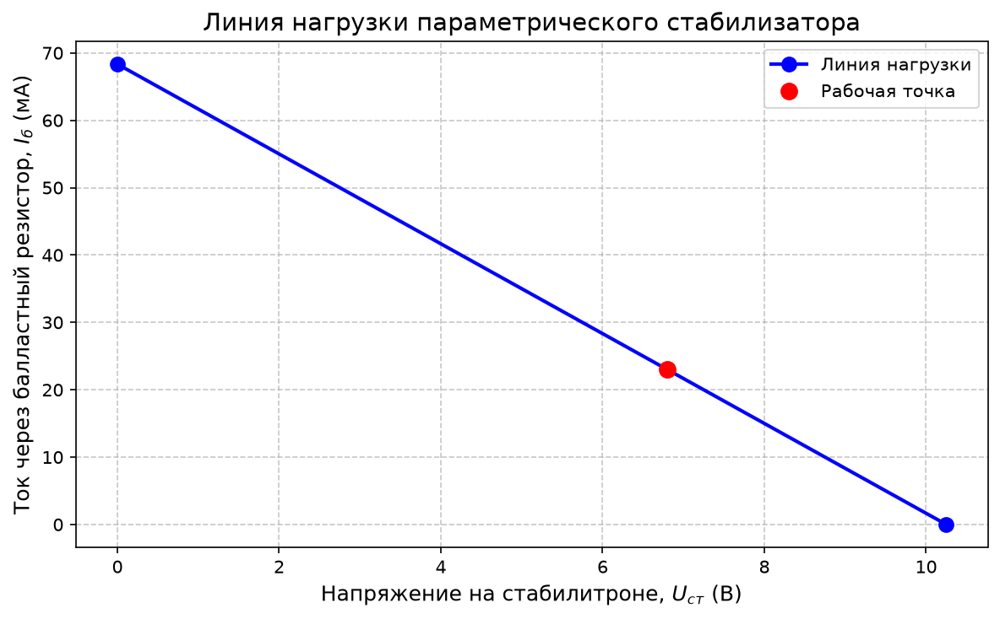
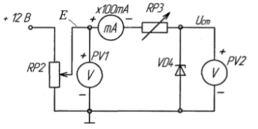
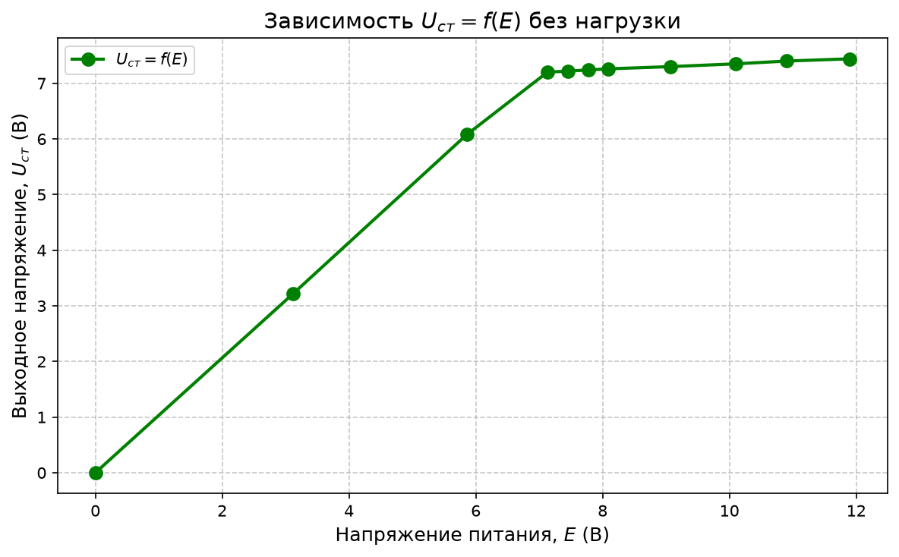
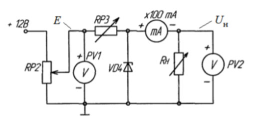
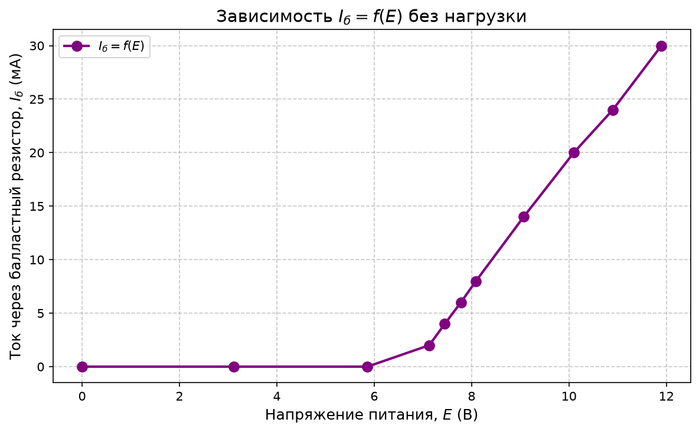
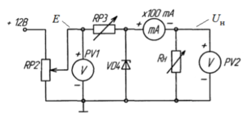
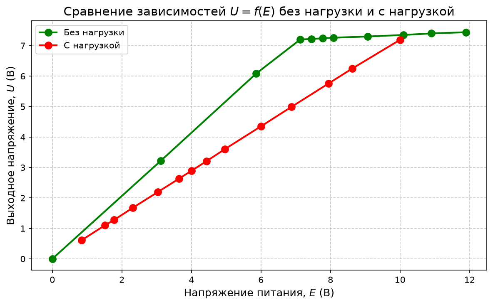

# Работа №2: Исследование параметрического стабилизатора напряжения

## Цель работы

Исследование параметров и характеристик параметрического стабилизатора постоянного напряжения.

---

# Упражнение 1. Расчёт параметрического стабилизатора

Необходимо рассчитать величину сопротивления балластного резистора параметрического стабилизатора напряжения для схемы, где:

$$
R_{\text{б}} = RP3
$$

Балластный резистор рассчитывается по формуле:

$$
R_{\text{б}}=
\frac{E_{\text{ср}}-U_{\text{ст}}}{I_{\text{ст ср}}+I_{\text{н}}}
$$

где:

$$
E_{\text{ср}}=\frac{E_{\max}+E_{\min}}{2}
$$

— среднее значение диапазона изменения входного напряжения питания;

$$
U_{\text{ст}}
$$

— напряжение стабилизации стабилитрона;

$$
I_{\text{ст ср}}=\frac{I_{\text{ст max}}+I_{\text{ст min}}}{2}
$$

— среднее значение диапазона изменения тока стабилизации стабилитрона;

$$
I_{\text{н}}
$$

— ток нагрузки.

Исходные данные:

| Параметр | Значение |
|:--|:--:|
| $E_{\min}$ | $8.5$ В |
| $E_{\max}$ | $12$ В |
| $I_{\text{ст min}}$ | $1$ мА |
| $I_{\text{ст max}}$ | $25$ мА |
| $I_{\text{н}}$ | $10$ мА |
| $U_{\text{ст}}$ | $6.8$ В |

Среднее значение входного напряжения:

$$
E_{\text{ср}}=
\frac{12+8.5}{2}
=
10.25 \text{ В}
$$

Среднее значение тока стабилизации:

$$
I_{\text{ст ср}}=
\frac{0.025+0.001}{2}
=
0.013 \text{ А}
$$

Тогда сопротивление балластного резистора:

$$
R_{\text{б}}=
\frac{10.25-6.8}{0.013+0.01}
$$

$$
R_{\text{б}}=
\frac{3.45}{0.023}
=
150 \ \Omega
$$

Итак:

$$
R_{\text{б}}=150 \ \Omega
$$

---

## Расчёт мощности, рассеиваемой на балластном резисторе

Мощность на балластном резисторе определяется по формуле:

$$
P_{\text{т}}=I_{\text{б}}^2R_{\text{б}}
$$

При токе:

$$
I_{\text{б}}=0.021 \text{ А}
$$

получаем:

$$
P_{\text{т}}=(0.021)^2 \cdot 150
$$

$$
P_{\text{т}}=0.06615 \text{ Вт}
$$

Итак:

$$
P_{\text{т}}\approx 0.066 \text{ Вт}
$$

---

# Упражнение 2. Исследование параметрического стабилизатора без нагрузки при изменении напряжения питания

Измеряется зависимость выходного напряжения стабилизатора от напряжения источника питания:

$$
U_{\text{ст}}=f(E)
$$

при отсутствии нагрузки.

**Рис. 1. Схема параметрического стабилизатора напряжения без нагрузки.**

В схеме используется балластный резистор:

$$
RP3 \approx R_{\text{б}} = 150 \ \Omega
$$

---

## Результаты измерений

| № | $E$, В | $U_{\text{ст}}$, В | $I_{\text{б}}$, мА |
|:--:|:--:|:--:|:--:|
| 1 | 0 | 0 | 0 |
| 2 | 3.12 | 3.22 | 0 |
| 3 | 5.86 | 6.08 | 0 |
| 4 | 7.13 | 7.20 | 2 |
| 5 | 7.45 | 7.22 | 4 |
| 6 | 7.78 | 7.24 | 6 |
| 7 | 8.09 | 7.26 | 8 |
| 8 | 9.07 | 7.30 | 14 |
| 9 | 10.10 | 7.35 | 20 |
| 10 | 10.90 | 7.40 | 24 |
| 11 | 11.90 | 7.44 | 30 |

**Таблица 1 — Зависимость выходного напряжения $U_{\text{ст}}$ от напряжения питания $E$ при отсутствии нагрузки.**

---

## Определение напряжения стабилизации и коэффициента стабилизации

По графику зависимости:

$$
U_{\text{ст}}=f(E)
$$

напряжение стабилизации составляет примерно:

$$
U_{\text{ст}} \approx 7.2 \text{ В}
$$

Коэффициент стабилизации на участке стабилизации определим по формуле:

$$
K_{\text{ст}}=
\frac{\Delta E}{\Delta U_{\text{ст}}}
$$

Для участка от $E=8.09$ В до $E=9.07$ В:

$$
\Delta E = 9.07 - 8.09 = 0.98 \text{ В}
$$

$$
\Delta U_{\text{ст}} = 7.30 - 7.26 = 0.04 \text{ В}
$$

Тогда:

$$
K_{\text{ст}}=
\frac{0.98}{0.04}
=
24.5
$$

Итак:

$$
K_{\text{ст}} \approx 24.5
$$

---

# Упражнение 3. Исследование параметрического стабилизатора при изменении нагрузки

Измеряется зависимость выходного напряжения стабилизатора от тока нагрузки при постоянном напряжении питания:

$$
U_{\text{н}}=f(I_{\text{н}})
$$

**Рис. 2. Схема параметрического стабилизатора напряжения с нагрузкой.**

---

## Результаты измерений

| № | $I_{\text{н}}$, мА | $U_{\text{н}}$, В |
|:--:|:--:|:--:|
| 1 | 40 | 4.20 |
| 2 | 34 | 5.09 |
| 3 | 30 | 5.83 |
| 4 | 26 | 6.39 |
| 5 | 20 | 7.18 |
| 6 | 16 | 7.21 |
| 7 | 12 | 7.24 |
| 8 | 10 | 7.27 |
| 9 | 8 | 7.29 |
| 10 | 6 | 7.31 |
| 11 | 4 | 7.33 |

**Таблица 2 — Зависимость выходного напряжения $U_{\text{н}}$ от тока нагрузки $I_{\text{н}}$.**

---

## Определение выходного дифференциального сопротивления

Выходное дифференциальное сопротивление параметрического стабилизатора на участке стабилизации определяется по формуле:

$$
R_{\text{вых диф}} \approx
\left|
\frac{\Delta U_{\text{н}}}{\Delta I_{\text{н}}}
\right|
$$

Для участка от $I_{\text{н}}=16$ мА до $I_{\text{н}}=30$ мА:

$$
\Delta U_{\text{н}} = 5.83 - 7.21 = -1.38 \text{ В}
$$

$$
\Delta I_{\text{н}} = 30 - 16 = 14 \text{ мА} = 0.014 \text{ А}
$$

Тогда:

$$
R_{\text{вых диф}}=
\left|
\frac{-1.38}{0.014}
\right|
$$

$$
R_{\text{вых диф}} \approx 98.6 \ \Omega
$$

Итак:

$$
R_{\text{вых диф}} \approx 98.6 \ \Omega
$$

---

# Упражнение 4. Исследование параметрического стабилизатора при изменении питающего напряжения при наличии нагрузки

Измеряется зависимость выходного напряжения стабилизатора от напряжения источника питания при наличии постоянной нагрузки:

$$
U_{\text{н}}=f(E)
$$

**Рис. 3. Схема параметрического стабилизатора напряжения с нагрузкой.**

---

## Результаты измерений

| № | $E$, В | $U_{\text{н}}$, В |
|:--:|:--:|:--:|
| 1 | 10.00 | 7.19 |
| 2 | 8.63 | 6.25 |
| 3 | 7.95 | 5.76 |
| 4 | 6.88 | 4.99 |
| 5 | 6.00 | 4.35 |
| 6 | 4.96 | 3.60 |
| 7 | 4.44 | 3.21 |
| 8 | 4.00 | 2.89 |
| 9 | 3.64 | 2.63 |
| 10 | 3.03 | 2.19 |
| 11 | 2.32 | 1.68 |
| 12 | 1.78 | 1.28 |
| 13 | 1.51 | 1.10 |
| 14 | 0.84 | 0.61 |

**Таблица 3 — Зависимость выходного напряжения $U_{\text{н}}$ от напряжения питания $E$ при наличии нагрузки.**

По результатам измерений строится график зависимости:

$$
U_{\text{н}}=f(E)
$$

# Вывод

В ходе лабораторной работы был исследован параметрический стабилизатор постоянного напряжения на стабилитроне.

В упражнении 1 был рассчитан балластный резистор стабилизатора. При заданных параметрах:

$$
E_{\min}=8.5 \text{ В}, \quad E_{\max}=12 \text{ В}
$$

$$
U_{\text{ст}}=6.8 \text{ В}
$$

$$
I_{\text{ст min}}=1 \text{ мА}, \quad I_{\text{ст max}}=25 \text{ мА}
$$

$$
I_{\text{н}}=10 \text{ мА}
$$

получено значение:

$$
R_{\text{б}}=150 \ \Omega
$$

Мощность, рассеиваемая на балластном резисторе, составила:

$$
P_{\text{т}}\approx 0.066 \text{ Вт}
$$

В упражнении 2 была снята зависимость выходного напряжения от напряжения питания без нагрузки. По полученной характеристике определено напряжение стабилизации:

$$
U_{\text{ст}}\approx 7.2 \text{ В}
$$

На участке стабилизации коэффициент стабилизации составил:

$$
K_{\text{ст}}\approx 24.5
$$

Это показывает, что при изменении входного напряжения выходное напряжение изменяется значительно слабее.

В упражнении 3 была исследована работа стабилизатора при изменении тока нагрузки. На участке стабилизации выходное напряжение изменяется сравнительно слабо, а при увеличении тока нагрузки напряжение на выходе уменьшается. По экспериментальным данным выходное дифференциальное сопротивление стабилизатора составило:

$$
R_{\text{вых диф}}\approx 98.6 \ \Omega
$$

В упражнении 4 была измерена зависимость выходного напряжения от входного напряжения при наличии нагрузки. При подключении нагрузки участок стабилизации становится менее выраженным, а для поддержания напряжения стабилизации требуется большее входное напряжение.

Таким образом, параметрический стабилизатор обеспечивает приблизительно постоянное выходное напряжение в определённом диапазоне входных напряжений и токов нагрузки. Его основные параметры зависят от напряжения стабилизации стабилитрона, сопротивления балластного резистора и величины подключённой нагрузки.
