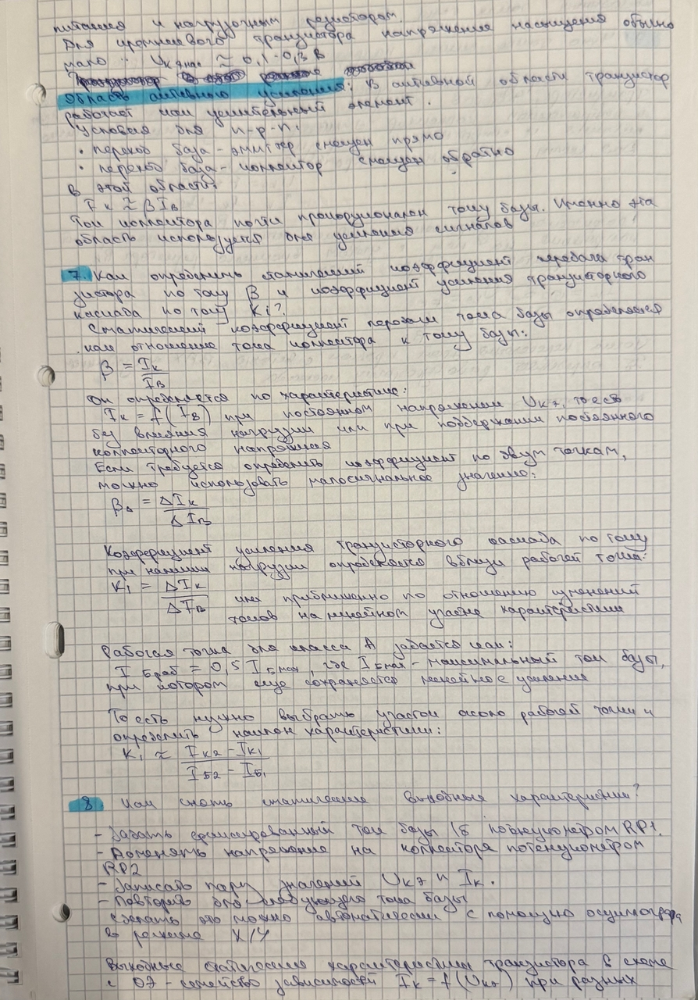
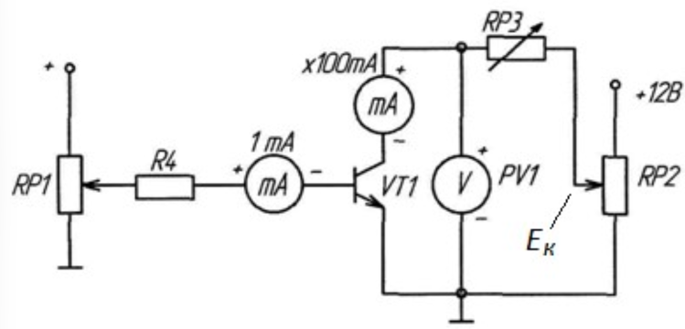
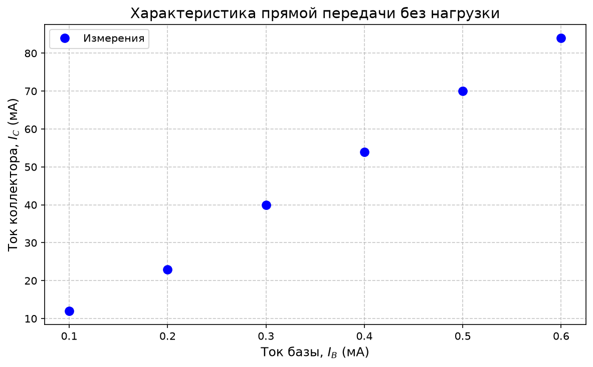
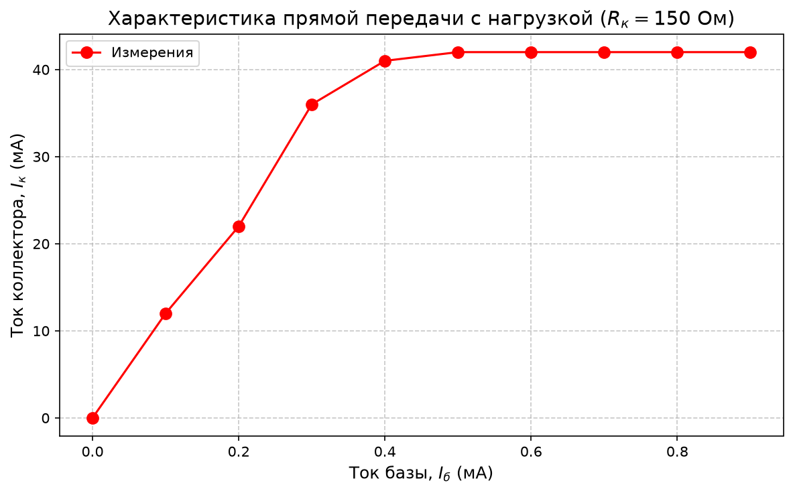
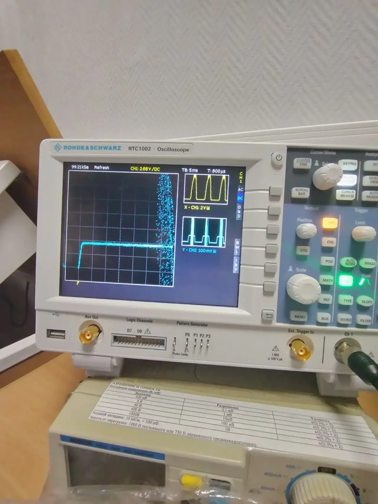

# Работа №3: Исследование биполярного транзистора

---

## Цель работы

Изучение характеристик и параметров биполярного транзистора, включенного по схеме с общим эмиттером

---

# Упражнение 1. Снятие характеристик прямой передачи по току биполярного транзистора (VT1)

## Схема эксперимента

В данном упражнении требуется измерить статическую характеристику прямой передачи по току $I_к=f(I_б)$при $R_к=0$ и при 
$U_к=E_к=8$

## Результаты измерений

| № | $I_б$, мА | $I_к$, мА |
|:--:|:---------:|:---------:|
| 1 |     0     |     0     |
| 2 |   0.06    |    14     |
| 3 |   0.28    |    35     |
| 4 |    0.4    |    50     |
| 5 |    0.5    |    76     |
| 6 |    0.6    |    99     |

---

## График зависимости $I_к=f(I_б)$

По построенному графику видно, что ток коллектора увеличивается при увеличении тока базы. Наклон графика соответствует 
коэффициенту передачи тока базы $\beta$.

---

## Расчёт статического коэффициента передачи тока $\beta$

Статический коэффициент передачи тока транзистора определяется по формуле:

$$
\beta=\frac{I_к}{I_б}
$$

Рассчитаем $\beta$ для каждой пары значений.

| №  | $I_б$, мА | $I_к$, мА | $\beta = I_к/I_б$|
|----|:---------:|:---------:|:-----------------:|
| 1  |   0.06    |    14     |        233        |
| 2  |   0.28    |    35     |      124.99       |
| 3  |    0.4    |    50     |        125        |
| 4  |    0.5    |    76     |152 |
| 5  |    0.6    |    99     |165 |

Среднее значение коэффициента передачи тока:

$$
\beta_{\mathrm{ср}}=
\frac{233+124.99+125+152+165}{5}
$$

$$
\beta_{\mathrm{ср}}\approx 160
$$

---

## Вывод по упражнению 1

В рабочем диапазоне токов коэффициент передачи тока изменяется от ~125 до ~165;
Среднее значение коэффициента передачи тока можно принять равным:

$$
\beta_{\mathrm{ср}}\approx 160
$$

Полученная зависимость $I_к=f(I_б)$ близка к линейной, что соответствует работе транзистора в активном режиме.

---

# Упражнение 2. Измерить характеристику прямой передачи по току при наличии заданного сопротивления нагрузки

## Схема эксперимента

В данном упражнении исследуется зависимость тока коллектора от тока базы при наличии сопротивления нагрузки в цепи коллектора.

---

## Результаты измерений

**Условия:** $R_к = 150\ \Omega$, $E_к = 8\ \text{В}$. Напряжение $U_к$ измеряется вольтметром PV1.

| № | $I_б$, мА | $I_к$, мА | U    |
|:--:|:---------:|:---------:|------|
| 1 |     0     |     0     | 8.00   |
| 2 |    0.1    |    12     | 5.72 |
| 3 |    0.2    |    22     | 3.58 |
| 4 |    0.3    |    36     | 1.45 |
| 5 |    0.4    |    41     | 0.35 |
| 6 |    0.5    |    42     | 0.21 |
| 7 |    0.6    |    42     | 0.19 |
| 8 |    0.7    |    42     | 0.17 |
| 9 |    0.8    |    42     | 0.16 |
| 10 |    0.9    |    42     | 0.15|

## График зависимости $I_к=f(I_б)$

### Определение режимов работы транзистора

- **Область отсечки:** $I_б = 0$, $I_к = 0$.
- **Активная область (усиления):** примерно $0 < I_б \leq 0.2\ \text{мА}$. Рост тока коллектора пропорционален току базы.
- **Область насыщения:** $I_б \geq 0.3\ \text{мА}$. Ток коллектора достигает максимального значения около $42\ \text{мА} $и далее практически не меняется.

**Максимальный ток базы для линейного усиления:** $I_{B\ \max} \approx 0.2\ \text{мА}$.

### Расчёт коэффициента усиления каскада по току $K_i$

Рабочая точка класса А: $I_{B\ \text{раб}} = 0.5 \cdot I_{B\ \max} = 0.1\ \text{мА}$.

Используем ближайшие измеренные точки в активной области:
- $I_{б1} = 0.1\ \text{мА}$, $I_{к1} = 12\ \text{мА}$
- $I_{б2} = 0.2\ \text{мА}$, $I_{к2} = 22\ \text{мА}$

$$
K_i = \frac{\Delta I_к}{\Delta I_б} = \frac{22 - 12}{0.2 - 0.1} = \frac{10}{0.1} = 100
$$

### Вывод
При наличии нагрузки транзисторный каскад работает в трёх режимах: отсечки, активного усиления и насыщения. Максимальный ток базы, при котором сохраняется линейное усиление, равен приблизительно $0.2\ \text{мА} $. Коэффициент усиления по току в рабочей точке $K_i \approx 100 $.

---

# Упражнение 3. Измерение выходных статических ВАХ биполярного транзистора с помощью осциллографа

#### Схема эксперимента
Осциллограф включён в режим X-Y:
- Канал X (CH1): напряжение коллектор-эмиттер $U_{кэ}$
- Канал Y (CH2): напряжение на токовом шунте $U_R = I_к \cdot R$
Заземление осциллографа подключено к общему проводу схемы.

Ток базы устанавливается потенциометром RP1 и контролируется миллиамперметром PA1.

### Осциллограмма

### Анализ
Полученное семейство выходных характеристик $I_к = f(U_{кэ})$ наглядно демонстрирует:
- Пологие участки (активный режим), где ток почти не зависит от напряжения.
- Крутое нарастание тока при малых $U_{кэ}$(область насыщения).

## Общий вывод
В ходе лабораторной работы экспериментально исследован биполярный транзистор n-p-n типа в схеме с общим эмиттером.

- Без нагрузки передаточная характеристика $I_к(I_б)$ близка к линейной; статический коэффициент передачи тока 
$\beta \approx 160$.
- С нагрузкой $R_к = 150\ \text{Ом}$ выделены три режима: отсечка, активное усиление и насыщение. Максимальный ток 
базы для линейного усиления ~0.2 мА, коэффициент усиления каскада по току $K_i = 100$.
- По выходным ВАХ подтверждены типичные области работы транзистора.

Проделанные опыты подтверждают, что малый ток базы управляет значительно большим током коллектора, а биполярный 
транзистор в схеме ОЭ может работать в ключевом или усилительном режиме.