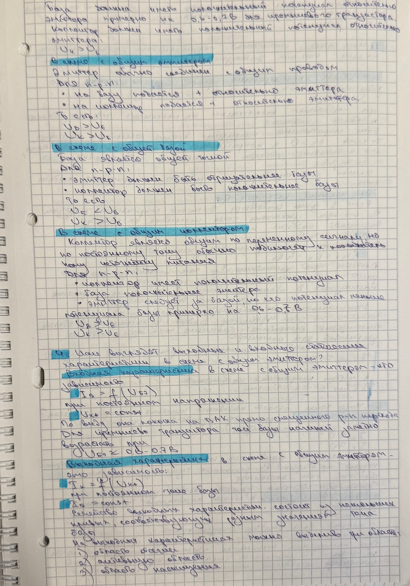
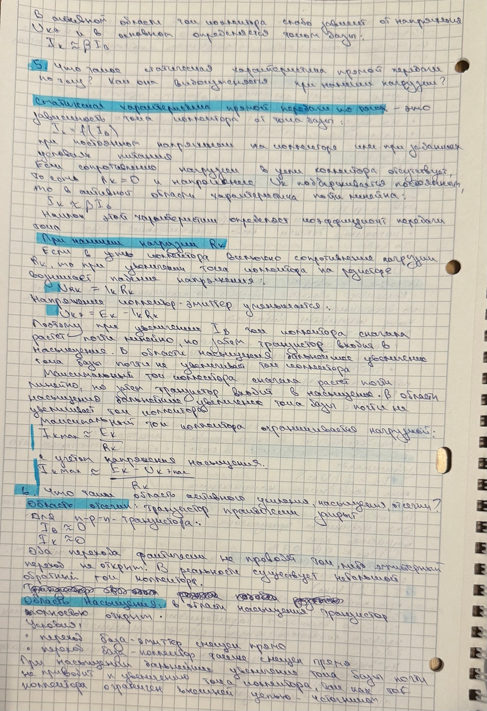
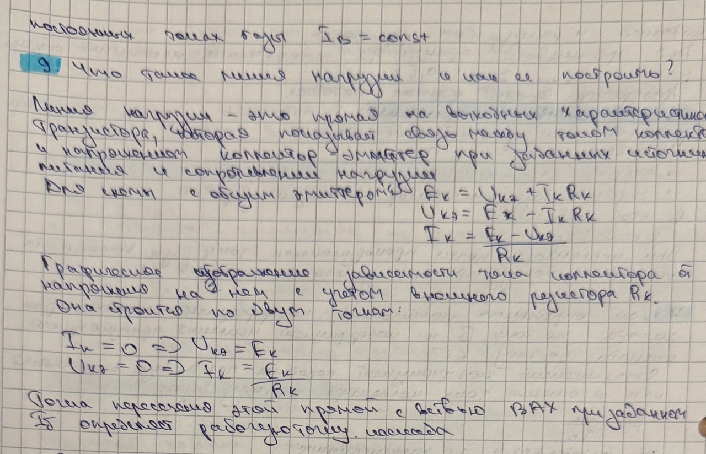
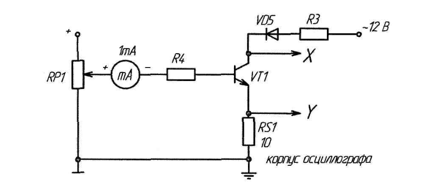
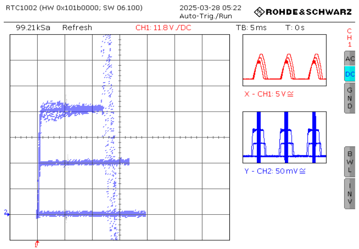

# Работа №3: Исследование биполярного транзистора

## Цель работы

Изучение характеристик, параметров и режимов работы биполярного транзистора n-p-n типа, включённого по схеме с общим эмиттером.

---

# Упражнение 1. Измерение статической характеристики прямой передачи по току $I_C=f(I_B)$ при отсутствии нагрузки

## Схема эксперимента

В данном упражнении исследуется зависимость коллекторного тока транзистора от тока базы при отсутствии нагрузки в цепи коллектора.

---

## Результаты измерений

| № | $I_B$, мА | $I_C$, мА |
|:--:|:--:|:--:|
| 1 | 0.6 | 84 |
| 2 | 0.5 | 70 |
| 3 | 0.4 | 54 |
| 4 | 0.3 | 40 |
| 5 | 0.2 | 23 |
| 6 | 0.1 | 12 |

---

## График зависимости $I_C=f(I_B)$

По построенному графику видно, что ток коллектора увеличивается при увеличении тока базы. Наклон графика соответствует 
коэффициенту передачи тока базы $\beta$.

---

## Расчёт статического коэффициента передачи тока $\beta$

Статический коэффициент передачи тока транзистора определяется по формуле:

$$
\beta=\frac{I_C}{I_B}
$$

Рассчитаем $\beta$ для каждой пары значений.

| № | $I_B$, мА | $I_C$, мА | $\beta = I_C/I_B$ |
|:--:|:--:|:--:|:--:|
| 1 | 0.6 | 84 | 140 |
| 2 | 0.5 | 70 | 140 |
| 3 | 0.4 | 54 | 135 |
| 4 | 0.3 | 40 | 133.3 |
| 5 | 0.2 | 23 | 115 |
| 6 | 0.1 | 12 | 120 |

Среднее значение коэффициента передачи тока:

$$
\beta_{\mathrm{ср}}=
\frac{140+140+135+133.3+115+120}{6}
$$

$$
\beta_{\mathrm{ср}}\approx 130.6
$$

Итак:

$$
\beta_{\mathrm{ср}}\approx 131
$$

---

## Вывод по упражнению 1

По результатам измерений видно, что коэффициент передачи тока $\beta$ не является строго постоянным и зависит от тока базы. При больших токах базы, начиная примерно с $I_B\geq 0.3$ мА, значение $\beta$ находится в диапазоне $130\text{–}140$. При меньших токах базы коэффициент передачи тока несколько ниже и составляет примерно $115\text{–}120$.

Среднее значение коэффициента передачи тока можно принять равным:

$$
\beta_{\mathrm{ср}}\approx 130
$$

Полученная зависимость $I_C=f(I_B)$ близка к линейной, что соответствует работе транзистора в активном режиме.

---

# Упражнение 2. Измерение статической характеристики прямой передачи по току $I_C=f(I_B)$ при наличии нагрузки

## Схема эксперимента

В данном упражнении исследуется зависимость тока коллектора от тока базы при наличии сопротивления нагрузки в цепи коллектора.

---

## Результаты измерений

| № | $I_B$, мА | $I_C$, мА |
|:--:|:--:|:--:|
| 1 | 0 | 0 |
| 2 | 0.02 | 2 |
| 3 | 0.04 | 4 |
| 4 | 0.08 | 8 |
| 5 | 0.10 | 10 |
| 6 | 0.14 | 16 |
| 7 | 0.18 | 20 |
| 8 | 0.20 | 20 |
| 9 | 0.40 | 20 |
| 10 | 0.60 | 20 |

---

## График зависимости $I_C=f(I_B)$

---

## Определение режимов работы транзистора

По полученной характеристике можно выделить три области работы транзистора.

### 1. Область отсечки

При:

$$
I_B=0
$$

ток коллектора также равен нулю:

$$
I_C=0
$$

В этом режиме транзистор закрыт.

---

### 2. Активная область

В активной области ток коллектора приблизительно пропорционален току базы. По экспериментальным данным линейный рост наблюдается примерно в диапазоне:

$$
0<I_B<0.18 \text{ мА}
$$

На этом участке транзистор работает как усилительный элемент.

Максимальный ток базы, при котором ещё сохраняется линейное усиление:

$$
I_{B \max}\approx 0.18 \text{ мА}
$$

---

### 3. Область насыщения

При токе базы:

$$
I_B\geq 0.2 \text{ мА}
$$

ток коллектора практически перестаёт увеличиваться и остаётся примерно равным:

$$
I_C\approx 20 \text{ мА}
$$

В этом режиме транзистор находится в насыщении, а ток коллектора ограничивается внешней цепью, то есть источником питания и сопротивлением нагрузки.

---

## Расчёт коэффициента усиления каскада по току $K_i$

Рабочая точка для класса А выбирается как:

$$
I_{Bраб}=0.5 I_{B \max}
$$

$$
I_{Bраб}=0.5 \cdot 0.18 = 0.09 \text{ мА}
$$

Для определения коэффициента усиления по току выбираем две ближайшие точки в активной области:

$$
I_{B1}=0.08 \text{ мА}, \quad I_{C1}=8 \text{ мА}
$$

$$
I_{B2}=0.10 \text{ мА}, \quad I_{C2}=10 \text{ мА}
$$

Коэффициент усиления по току:

$$
K_i=
\frac{\Delta I_C}{\Delta I_B}
$$

$$
K_i=
\frac{10-8}{0.10-0.08}
$$

$$
K_i=
\frac{2}{0.02}
=
100
$$

Итак:

$$
K_i\approx 100
$$

---

## Вывод по упражнению 2

При наличии нагрузки транзистор работает в трёх режимах:

1. **Режим отсечки** — при $I_B=0$, ток коллектора отсутствует.
2. **Активный режим** — при $0<I_B<0.18$ мА, ток коллектора примерно линейно зависит от тока базы.
3. **Режим насыщения** — при $I_B\geq 0.2$ мА, ток коллектора достигает максимального значения около $20$ мА и далее практически не растёт.

Максимальный ток базы, при котором сохраняется линейное усиление:

$$
I_{B \max}\approx 0.18 \text{ мА}
$$

Коэффициент усиления каскада по току вблизи рабочей точки:

$$
K_i\approx 100
$$

Это означает, что в активной области изменение тока базы на $1$ мА соответствует изменению тока коллектора примерно на $100$ мА.

---

# Упражнение 3. Измерение выходных статических ВАХ биполярного транзистора с помощью осциллографа

## Схема эксперимента

В данном упражнении выходные статические характеристики транзистора получаются с помощью осциллографа в режиме $X/Y$.

На вход $X$ осциллографа подаётся напряжение коллектор-эмиттер:

$$
U_{CE}
$$

На вход $Y$ подаётся напряжение с измерительного шунта, пропорциональное току коллектора:

$$
U_R = I_C R
$$

Следовательно, ток коллектора определяется по формуле:

$$
I_C=
\frac{U_R}{R}
$$

---

## Осциллограммы выходных характеристик

Выходные характеристики были получены для трёх значений тока базы:

$$
I_{B1}=0
$$

$$
I_{B2}=0.5 I_{B \max}
$$

$$
I_{B3}=I_{B \max}
$$

С учётом найденного значения:

$$
I_{B \max}\approx 0.18 \text{ мА}
$$

получаем:

$$
I_{B1}=0
$$

$$
I_{B2}=0.09 \text{ мА}
$$

$$
I_{B3}=0.18 \text{ мА}
$$

**Рис. 6. Выходные характеристики транзистора при разных токах базы.**

---

## Анализ выходных характеристик

Выходная ВАХ транзистора в схеме с общим эмиттером представляет собой зависимость:

$$
I_C=f(U_{CE})
$$

при постоянном токе базы:

$$
I_B=const
$$

По семейству выходных характеристик можно выделить несколько областей:

1. **Область отсечки**  
   При $I_B=0$ ток коллектора практически отсутствует.

2. **Активная область**  
   При увеличении $U_{CE}$ ток коллектора слабо зависит от напряжения коллектор-эмиттер и в основном определяется током базы. Эта область используется для усиления сигналов.

3. **Область насыщения**  
   При малых значениях $U_{CE}$ транзистор находится в насыщении. В этой области оба p-n-перехода транзистора смещены в прямом направлении.

---

# Общий вывод

В ходе лабораторной работы были исследованы характеристики и режимы работы биполярного транзистора n-p-n типа в схеме с общим эмиттером.

В первом упражнении была снята статическая характеристика прямой передачи по току при отсутствии нагрузки:

$$
I_C=f(I_B)
$$

По экспериментальным данным был определён статический коэффициент передачи тока базы:

$$
\beta_{\mathrm{ср}}\approx 130
$$

Полученная зависимость близка к линейной, что соответствует активному режиму работы транзистора.

Во втором упражнении была снята характеристика прямой передачи по току при наличии нагрузки. По ней были определены три режима работы транзистора:

- отсечка;
- активный режим;
- насыщение.

Максимальный ток базы, при котором ещё сохраняется линейное усиление:

$$
I_{B \max}\approx 0.18 \text{ мА}
$$

Коэффициент усиления каскада по току вблизи рабочей точки:

$$
K_i\approx 100
$$

В третьем упражнении с помощью осциллографа были получены выходные статические характеристики транзистора. Они показывают зависимость тока коллектора от напряжения коллектор-эмиттер при различных токах базы.

Таким образом, в работе подтверждено, что малый ток базы управляет значительно большим током коллектора, а биполярный транзистор в схеме с общим эмиттером может работать в режимах отсечки, активного усиления и насыщения.
