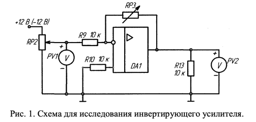
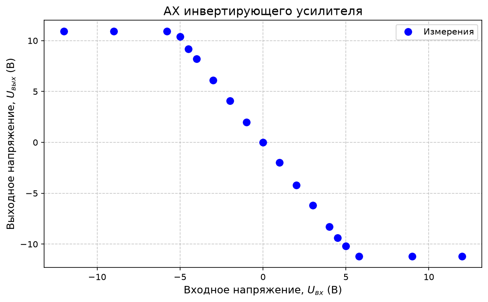
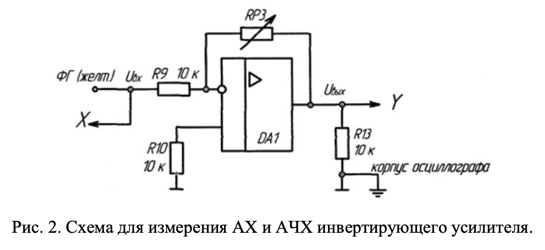
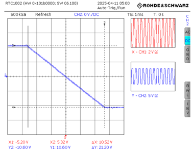
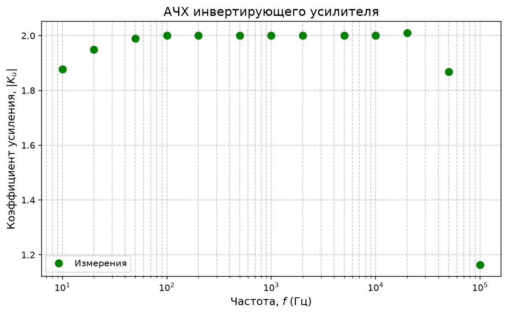
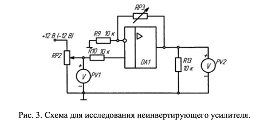
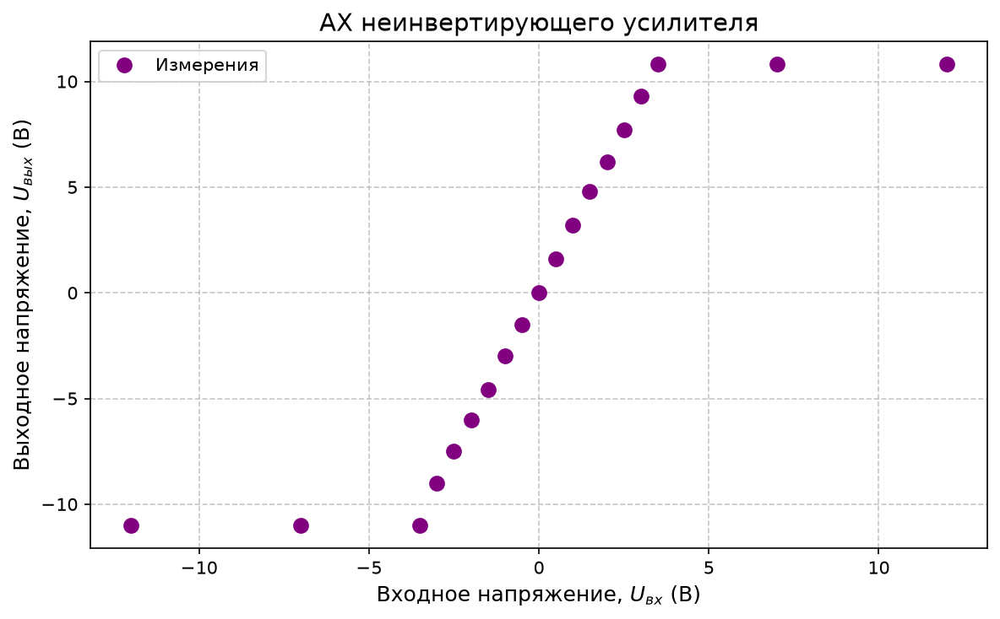
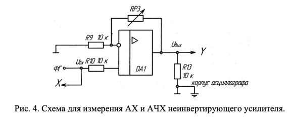
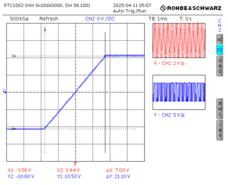
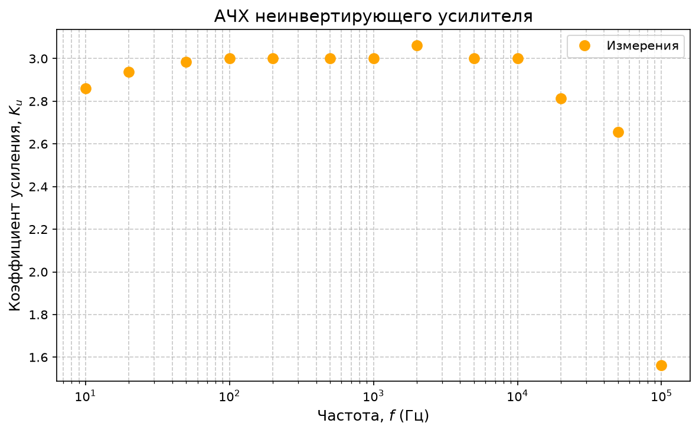

# Работа №4: Исследование инвертирующего и неинвертирующего усилителей на ОУ

## Цель работы

Изучение схем включения операционного усилителя с отрицательной обратной связью в качестве инвертирующего и неинвертирующего усилителей.

# Упражнение 1. Экспериментальное исследование инвертирующего усилителя

## 1.1. Измерение амплитудной характеристики инвертирующего усилителя на постоянном токе

### Схема эксперимента

### Параметры схемы

$$
RP3 = 20 \text{ кОм}
$$

Теоретический коэффициент усиления по напряжению для инвертирующего усилителя определяется по формуле:

$$
K_{u \text{ инв т}}=-\frac{RP3}{R9}
$$

При заданных параметрах схемы:

$$
K_{u \text{ инв т}}=-2
$$

---

## Результаты измерений при положительном входном напряжении

| № | $U_{\text{вх}}$, В | $U_{\text{вых}}$, В |
|:--:|:--:|:--:|
| 1 | 0 | 0 |
| 2 | 1 | -2 |
| 3 | 2 | -4.2 |
| 4 | 3 | -6.2 |
| 5 | 4 | -8.3 |
| 6 | 4.5 | -9.4 |
| 7 | 5 | -10.2 |
| 8 | 5.8 | -11.2 |
| 9 | 9 | -11.2 |
| 10 | 12 | -11.2 |

---

## Результаты измерений при отрицательном входном напряжении

| № | $U_{\text{вх}}$, В | $U_{\text{вых}}$, В |
|:--:|:--:|:--:|
| 1 | 0 | 0 |
| 2 | -1 | 2 |
| 3 | -2 | 4.1 |
| 4 | -3 | 6.1 |
| 5 | -4 | 8.2 |
| 6 | -4.5 | 9.2 |
| 7 | -5 | 10.4 |
| 8 | -5.8 | 10.9 |
| 9 | -9 | 10.9 |
| 10 | -12 | 10.9 |

---

## График зависимости $U_{\text{вых}}=f(U_{\text{вх}})$

---

## Расчёт экспериментального коэффициента усиления

Коэффициент усиления по напряжению определяется как:

$$
K_{u \text{ инв э}}=
\frac{U_{\text{вых}}}{U_{\text{вх}}}
$$

Для положительного входного напряжения при $U_{\text{вх}}=1$ В:

$$
K_{u \text{ инв э}}=
\frac{-2}{1}
=
-2
$$

Для отрицательного входного напряжения при $U_{\text{вх}}=-1$ В:

$$
K_{u \text{ инв э}}=
\frac{2}{-1}
=
-2
$$

Итак:

$$
K_{u \text{ инв э}} \approx -2
$$

Экспериментальный коэффициент усиления совпадает с теоретическим:

$$
K_{u \text{ инв т}} \approx K_{u \text{ инв э}} \approx -2
$$

---

## Вывод по пункту 1.1

Инвертирующий усилитель работает в линейном режиме примерно при входных напряжениях от $-5$ В до $+5$ В. При больших по модулю входных напряжениях наблюдается насыщение, то есть ограничение выходного напряжения уровнем около $\pm 11$ В.

Схема корректно инвертирует сигнал: при положительном входном напряжении выходное напряжение отрицательное, а при отрицательном входном напряжении — положительное.

---

# 1.2. Измерение амплитудной характеристики инвертирующего усилителя с помощью осциллографа

## Схема эксперимента

## Масштабы осциллографа

$$
O_x = 2 \text{ В/дел}
$$

$$
O_y = 5 \text{ В/дел}
$$

## Осциллограмма амплитудной характеристики

---

## Определение коэффициента усиления по осциллограмме

По осциллограмме:

$$
U_{\text{вх}} = 5.26 \text{ В}
$$

$$
U_{\text{вых}} = 10.60 \text{ В}
$$

Так как усилитель инвертирующий, коэффициент усиления имеет отрицательный знак:

$$
K_u=
-\frac{U_{\text{вых}}}{U_{\text{вх}}}
$$

$$
K_u=
-\frac{10.60}{5.26}
\approx -2.01
$$

Итак:

$$
K_u \approx -2.01
$$

---

## Вывод по пункту 1.2

Амплитудная характеристика, полученная с помощью осциллографа, подтверждает инвертирующий характер усилителя. Экспериментальное значение коэффициента усиления:

$$
K_u \approx -2.01
$$

близко к теоретическому значению:

$$
K_{u \text{ инв т}}=-2
$$

---

# 1.3. Измерение амплитудно-частотной характеристики инвертирующего усилителя

Измеряется зависимость коэффициента усиления от частоты:

$$
K_{u \text{ инв}} = F(f)
$$

## Схема эксперимента

## Параметры измерений

$$
U_{\text{вх}} = 9.8 \text{ В}
$$

Коэффициент усиления рассчитывается по формуле:

$$
K_{u \text{ инв}}=
\frac{U_{\text{вых}}}{U_{\text{вх}}}
$$

При построении АЧХ используется модуль коэффициента усиления.

---

## Результаты измерений

| № | $f$, Гц | $U_{\text{вых}}$, В | $\lvert K_{u \text{ инв}} \rvert$ |
|---|---|---|---|
| 1 | 10 | 18.4 | 1.878 |
| 2 | 20 | 19.1 | 1.949 |
| 3 | 50 | 19.5 | 1.990 |
| 4 | 100 | 19.6 | 2.000 |
| 5 | 200 | 19.6 | 2.000 |
| 6 | 500 | 19.6 | 2.000 |
| 7 | 1k | 19.6 | 2.000 |
| 8 | 2k | 19.6 | 2.000 |
| 9 | 5k | 19.6 | 2.000 |
| 10 | 10k | 19.6 | 2.000 |
| 11 | 20k | 19.7 | 2.010 |
| 12 | 50k | 18.3 | 1.867 |
| 13 | 100k | 11.4 | 1.163 |

---

## График АЧХ

---

## Определение верхней граничной частоты

Коэффициент усиления в полосе пропускания:

$$
K_0 \approx 2
$$

Верхняя граничная частота определяется по уровню:

$$
K(f_{\text{в}})=\frac{K_0}{\sqrt{2}}
$$

или приблизительно:

$$
K(f_{\text{в}})=0.707K_0
$$

Тогда:

$$
K(f_{\text{в}})=0.707 \cdot 2 \approx 1.414
$$

По таблице видно:

при

$$
f=50 \text{ кГц}
$$

$$
K=1.867
$$

а при

$$
f=100 \text{ кГц}
$$

$$
K=1.163
$$

Следовательно, граничная частота находится между $50$ кГц и $100$ кГц.

Приближённо:

$$
f_{\text{в инв}} \approx 70 \text{ кГц}
$$

---

## Вывод по пункту 1.3

Коэффициент усиления инвертирующего усилителя в полосе пропускания составляет примерно:

$$
K_0 \approx 2
$$

Верхняя граничная частота:

$$
f_{\text{в инв}} \approx 70 \text{ кГц}
$$

На высоких частотах наблюдается спад коэффициента усиления, что связано с ограниченной полосой пропускания операционного усилителя и влиянием паразитных ёмкостей схемы.

---

# Упражнение 2. Экспериментальное исследование неинвертирующего усилителя

## 2.1. Измерение амплитудной характеристики неинвертирующего усилителя на постоянном токе

## Схема эксперимента

## Параметры схемы

$$
RP3 = 20 \text{ кОм}
$$

Теоретический коэффициент усиления по напряжению для неинвертирующего усилителя:

$$
K_{u \text{ неин т}}=
1+\frac{RP3}{R9}
$$

При заданных параметрах схемы:

$$
K_{u \text{ неин т}}=3
$$

---

## Результаты измерений при положительном входном напряжении

| № | $U_{\text{вх}}$, В | $U_{\text{вых}}$, В |
|:--:|:--:|:--:|
| 1 | 0 | 0 |
| 2 | 0.5 | 1.6 |
| 3 | 1 | 3.2 |
| 4 | 1.5 | 4.8 |
| 5 | 2 | 6.2 |
| 6 | 2.5 | 7.7 |
| 7 | 3 | 9.3 |
| 8 | 3.5 | 10.8 |
| 9 | 7 | 10.8 |
| 10 | 12 | 10.8 |

---

## Результаты измерений при отрицательном входном напряжении

| № | $U_{\text{вх}}$, В | $U_{\text{вых}}$, В |
|:--:|:--:|:--:|
| 1 | 0 | 0 |
| 2 | -0.5 | -1.5 |
| 3 | -1 | -3 |
| 4 | -1.5 | -4.6 |
| 5 | -2 | -6 |
| 6 | -2.5 | -7.5 |
| 7 | -3 | -9 |
| 8 | -3.5 | -11 |
| 9 | -7 | -11 |
| 10 | -12 | -11 |

---

## Определение экспериментального коэффициента усиления

Для положительного входного напряжения:

$$
U_{\text{вх}}=0.5 \text{ В}
$$

$$
U_{\text{вых}}=1.6 \text{ В}
$$

$$
K_{u \text{ неин э}}=
\frac{1.6}{0.5}
=
3.2
$$

Для отрицательного входного напряжения:

$$
U_{\text{вх}}=-0.5 \text{ В}
$$

$$
U_{\text{вых}}=-1.5 \text{ В}
$$

$$
K_{u \text{ неин э}}=
\frac{-1.5}{-0.5}
=
3
$$

Среднее экспериментальное значение:

$$
K_{u \text{ неин э}} \approx 3.1
$$

---

## График зависимости $U_{\text{вых}}=f(U_{\text{вх}})$

---

## Вывод по пункту 2.1

Теоретический коэффициент усиления неинвертирующего усилителя равен:

$$
K_{u \text{ неин т}}=3
$$

Экспериментально получено близкое значение:

$$
K_{u \text{ неин э}}\approx 3.1
$$

Амплитудная характеристика линейна примерно до:

$$
U_{\text{вх}}\approx 3.5 \text{ В}
$$

После этого наблюдается ограничение выходного напряжения, то есть насыщение усилителя. Неинвертирующий усилитель не меняет знак выходного сигнала относительно входного.

---

# 2.2. Измерение амплитудной характеристики неинвертирующего усилителя с помощью осциллографа

## Схема эксперимента

## Масштабы осциллографа

$$
O_x = 2 \text{ В/дел}
$$

$$
O_y = 5 \text{ В/дел}
$$

## Осциллограмма амплитудной характеристики

---

## Определение коэффициента усиления по осциллограмме

По осциллограмме:

$$
X_1=-3.56 \text{ В}
$$

$$
X_2=3.44 \text{ В}
$$

$$
Y_1=-10.60 \text{ В}
$$

$$
Y_2=10.50 \text{ В}
$$

Размах входного напряжения:

$$
\Delta X=X_2-X_1
$$

$$
\Delta X=3.44-(-3.56)=7.00 \text{ В}
$$

Размах выходного напряжения:

$$
\Delta Y=Y_2-Y_1
$$

$$
\Delta Y=10.50-(-10.60)=21.10 \text{ В}
$$

Коэффициент усиления:

$$
K_u=
\frac{\Delta Y}{\Delta X}
$$

$$
K_u=
\frac{21.10}{7.00}
\approx 3.01
$$

Итак:

$$
K_u \approx 3.01
$$

---

## Вывод по пункту 2.2

Амплитудная характеристика, полученная с помощью осциллографа, подтверждает работу усилителя в линейном режиме с коэффициентом усиления:

$$
K_u \approx 3
$$

Наблюдается симметричное ограничение сигнала при выходе за пределы линейного диапазона на уровне примерно:

$$
\pm 10.5\text{–}10.6 \text{ В}
$$

что соответствует насыщению операционного усилителя.

---

# 2.3. Измерение амплитудно-частотной характеристики неинвертирующего усилителя

Измеряется зависимость коэффициента усиления от частоты:

$$
K_{u \text{ неин}}=F(f)
$$

## Схема эксперимента

## Параметры измерений

$$
U_{\text{вх}}=6.4 \text{ В}
$$

Коэффициент усиления рассчитывается по формуле:

$$
K_{u \text{ неин}}=
\frac{U_{\text{вых}}}{U_{\text{вх}}}
$$

---

## Результаты измерений

| № | $f$, Гц | $U_{\text{вых}}$, В | $K_{u \text{ неин}}$ |
|:--:|:--:|:--:|:--:|
| 1 | 10 | 18.3 | 2.86 |
| 2 | 20 | 18.8 | 2.94 |
| 3 | 50 | 19.1 | 2.98 |
| 4 | 100 | 19.2 | 3.00 |
| 5 | 200 | 19.2 | 3.00 |
| 6 | 500 | 19.2 | 3.00 |
| 7 | 1k | 19.2 | 3.00 |
| 8 | 2k | 19.6 | 3.06 |
| 9 | 5k | 19.2 | 3.00 |
| 10 | 10k | 19.2 | 3.00 |
| 11 | 20k | 18.0 | 2.81 |
| 12 | 50k | 17.0 | 2.66 |
| 13 | 100k | 10.0 | 1.56 |

---

## График АЧХ

---

## Определение верхней граничной частоты

Коэффициент усиления в полосе пропускания:

$$
K_0 \approx 3
$$

Граничная частота определяется по уровню:

$$
K(f_{\text{в}})=0.707K_0
$$

$$
K(f_{\text{в}})=0.707 \cdot 3 \approx 2.12
$$

Из таблицы видно:

при

$$
f=50 \text{ кГц}
$$

$$
K=2.66
$$

а при

$$
f=100 \text{ кГц}
$$

$$
K=1.56
$$

Следовательно, верхняя граничная частота находится между $50$ кГц и $100$ кГц.

Приближённо:

$$
f_{\text{в неин}} \approx 70 \text{ кГц}
$$

---

## Вывод по пункту 2.3

В полосе пропускания коэффициент усиления неинвертирующего усилителя составляет примерно:

$$
K_0 \approx 3
$$

что соответствует теоретическому расчёту. Верхняя граничная частота составляет примерно:

$$
f_{\text{в неин}} \approx 70 \text{ кГц}
$$

На высоких частотах наблюдается спад коэффициента усиления, что связано с ограниченной полосой пропускания операционного усилителя и влиянием паразитных ёмкостей схемы.

---

# Общий вывод

В ходе лабораторной работы были исследованы инвертирующий и неинвертирующий усилители на операционном усилителе с отрицательной обратной связью.

Для инвертирующего усилителя теоретический коэффициент усиления составил:

$$
K_{u \text{ инв т}}=-2
$$

Экспериментально по амплитудной характеристике на постоянном токе было получено:

$$
K_{u \text{ инв э}}\approx -2
$$

По осциллограмме амплитудной характеристики:

$$
K_u \approx -2.01
$$

Таким образом, экспериментальные данные хорошо согласуются с теоретическим расчётом. Инвертирующий усилитель изменяет знак выходного сигнала на противоположный.

Для неинвертирующего усилителя теоретический коэффициент усиления составил:

$$
K_{u \text{ неин т}}=3
$$

Экспериментально по амплитудной характеристике было получено:

$$
K_{u \text{ неин э}}\approx 3.1
$$

По осциллограмме:

$$
K_u \approx 3.01
$$

Неинвертирующий усилитель не изменяет фазу выходного сигнала относительно входного.

Также были исследованы амплитудно-частотные характеристики усилителей. Для инвертирующего усилителя:

$$
K_0 \approx 2
$$

$$
f_{\text{в инв}}\approx 70 \text{ кГц}
$$

Для неинвертирующего усилителя:

$$
K_0 \approx 3
$$

$$
f_{\text{в неин}}\approx 70 \text{ кГц}
$$

На высоких частотах коэффициент усиления уменьшается. Это связано с ограниченной полосой пропускания операционного усилителя. При больших входных напряжениях в обеих схемах наблюдалось насыщение, то есть ограничение выходного напряжения уровнем питания.

В результате работы были подтверждены основные свойства инвертирующего и неинвертирующего усилителей на ОУ с отрицательной обратной связью.
