# Работа №4. Исследование инвертирующего и неинвертирующего усилителей на ОУ

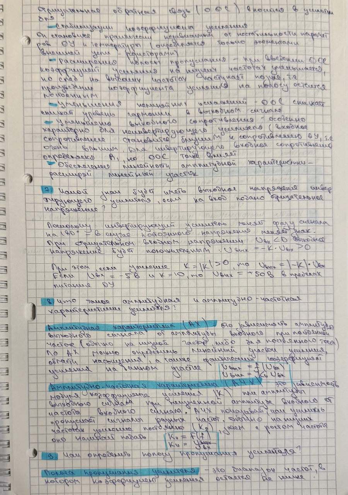
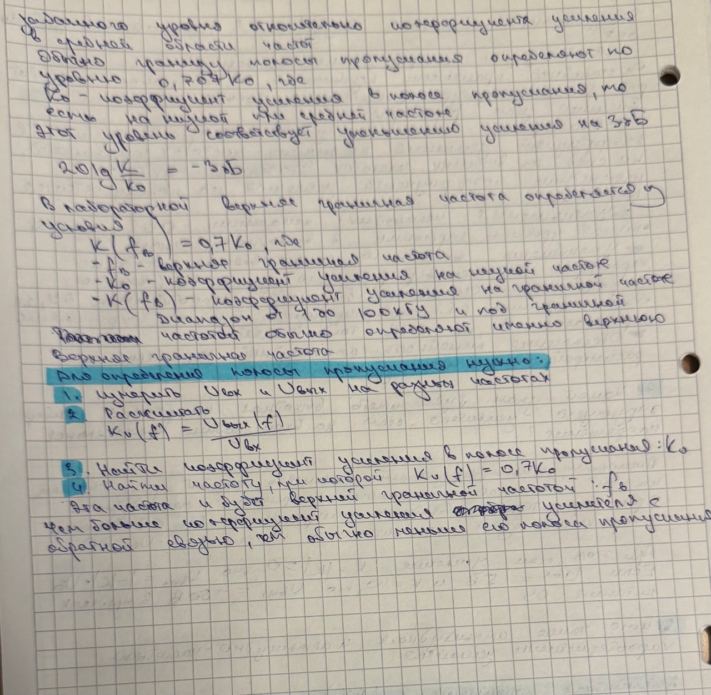

---

## Цель работы

Изучение схем включения операционного усилителя с отрицательной обратной связью в качестве инвертирующего и неинвертирующего усилителей, исследование их амплитудных и амплитудно-частотных характеристик, а также оценка выходного сопротивления.

---

# Схема эксперимента

## Параметры схемы

**Операционный усилитель:** AD712

### Основные характеристики AD712

* Тип: двухканальный прецизионный операционный усилитель;
* Диапазон напряжений питания: ±5…±18 В;
* Коэффициент усиления без обратной связи: более 100 дБ;
* Полоса единичного усиления (GBW): около 4 МГц;
* Малое входное напряжение смещения;
* Низкий уровень шумов.

---

# Задание 1

С помощью инструмента **DC Transfer Curve Analysis** были получены амплитудные характеристики инвертирующего усилителя для различных сопротивлений цепи обратной связи.

Амплитудная характеристика показывает зависимость

$$
U_{\text{вых}}=f(U_{\text{вх}})
$$

Для инвертирующего усилителя выходное напряжение находится в противофазе с входным сигналом, поэтому линейный участок характеристики имеет отрицательный наклон.

---

# 1. $R_{\text{ос}}=200~\text{кОм}$

$$
K_u=-\frac{200}{10}=20
$$

### Инвертирующий усилитель

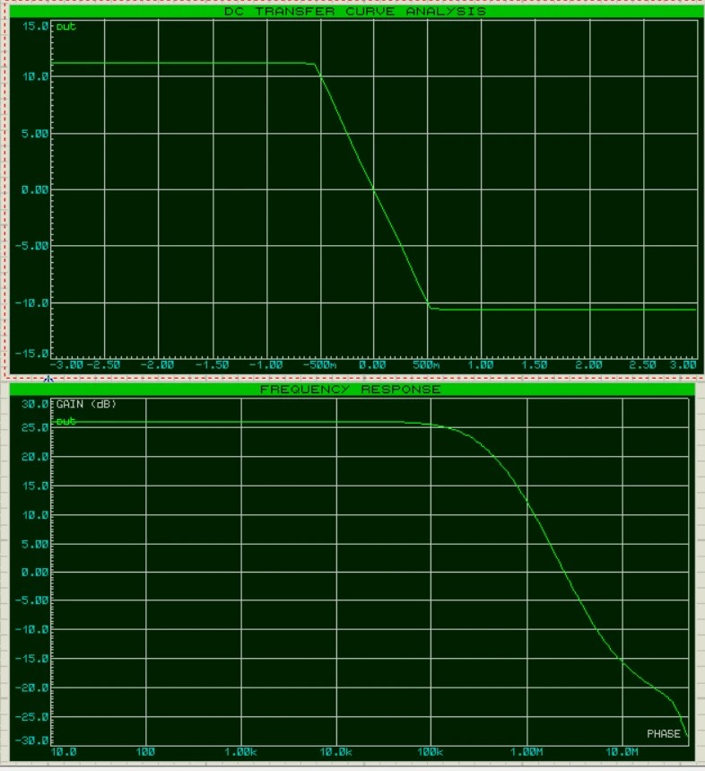

На верхнем графике представлена амплитудная характеристика инвертирующего усилителя. В линейной области выходное 
напряжение изменяется пропорционально входному с отрицательным наклоном, что соответствует коэффициенту усиления 
($K_u=-20$). При увеличении входного сигнала наблюдается насыщение выходного напряжения на уровне около ($\pm11$) В, 
обусловленное ограничением напряжения питания операционного усилителя.

Нижний график представляет амплитудно-частотную характеристику усилителя. В области низких частот коэффициент усиления 
остаётся практически постоянным и составляет около **26 дБ**. После достижения верхней граничной частоты начинается спад 
усиления, что связано с ограниченной полосой пропускания операционного усилителя AD712.

### Неинвертирующий усилитель

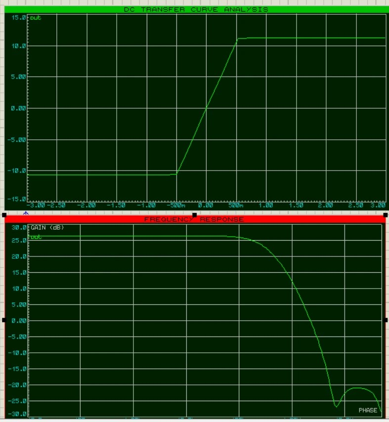

На верхнем графике представлена амплитудная характеристика неинвертирующего усилителя. Выходное напряжение изменяется 
синфазно с входным сигналом, поэтому линейный участок характеристики имеет положительный наклон. Коэффициент усиления 
составляет ($K_u=20$). При дальнейшем увеличении входного напряжения выходной сигнал достигает области насыщения и 
ограничивается напряжением питания.

Нижний график показывает амплитудно-частотную характеристику неинвертирующего усилителя. В рабочем диапазоне частот 
коэффициент усиления практически не изменяется и составляет около **26 дБ**. После достижения верхней граничной частоты
наблюдается уменьшение усиления, что соответствует теоретическим свойствам операционного усилителя с отрицательной 
обратной связью.

---

# 2. $R_{\text{ос}}=150~\text{кОм}$

$$
K_u=-\frac{150}{10}=15
$$

### Инвертирующий усилитель

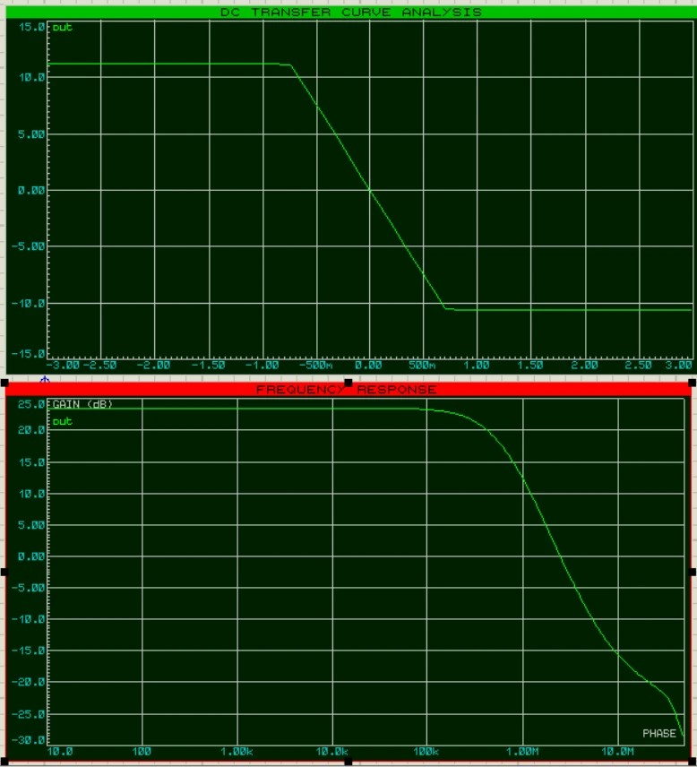

По сравнению с предыдущим режимом работы коэффициент усиления уменьшился до ($K_u=-15$), что привело к уменьшению наклона 
линейного участка амплитудной характеристики. При этом зависимость выходного напряжения от входного остаётся линейной в 
рабочем диапазоне, а насыщение по-прежнему наблюдается при достижении предельного выходного напряжения операционного 
усилителя. Смещение нуля остаётся практически равным нулю.

### Неинвертирующий усилитель

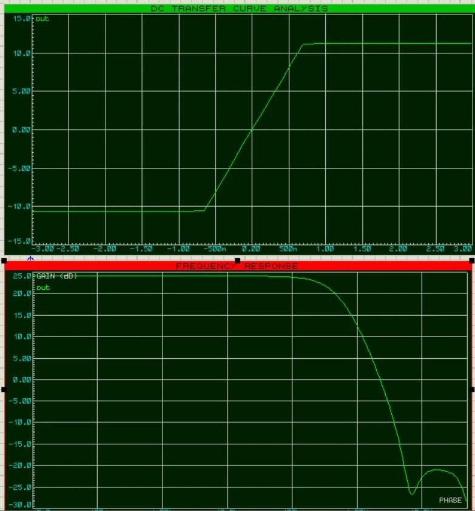

Амплитудно-частотная характеристика сохраняет прежнюю форму, однако по сравнению с предыдущим случаем наблюдается 
увеличение верхней граничной частоты. Это связано с уменьшением коэффициента усиления до (K_u=15), вследствие чего 
полоса пропускания усилителя расширяется. В области низких частот коэффициент усиления остаётся практически постоянным, 
а после достижения граничной частоты начинается его постепенное уменьшение.

---

# 3. $R_{\text{ос}}=100~\text{кОм}$

$$
K_u=-\frac{100}{10}=10
$$

### Инвертирующий усилитель

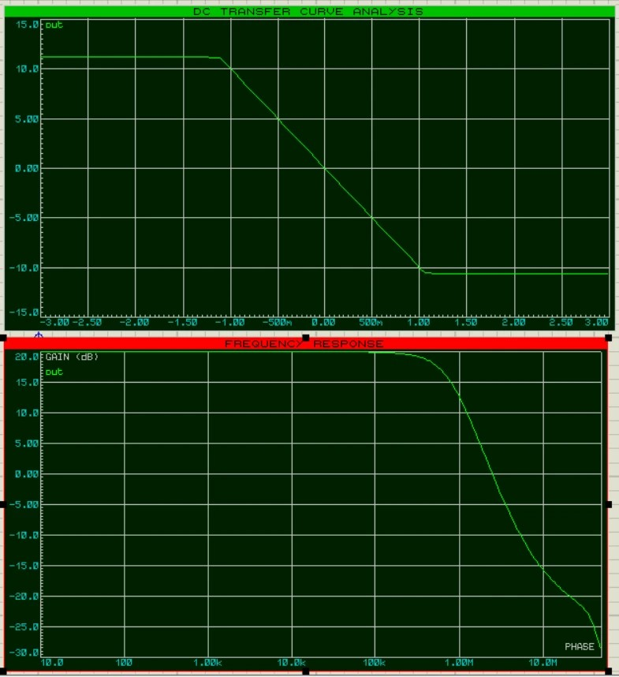

При уменьшении сопротивления обратной связи до $100~\text{кОм}$ коэффициент усиления составил $K_u=-10$. По сравнению с 
предыдущими режимами наклон линейного участка амплитудной характеристики уменьшился, что соответствует снижению усиления. 
При этом зависимость выходного напряжения от входного остаётся линейной в рабочем диапазоне, а ограничение выходного 
сигнала по-прежнему определяется напряжением питания операционного усилителя.

### Неинвертирующий усилитель

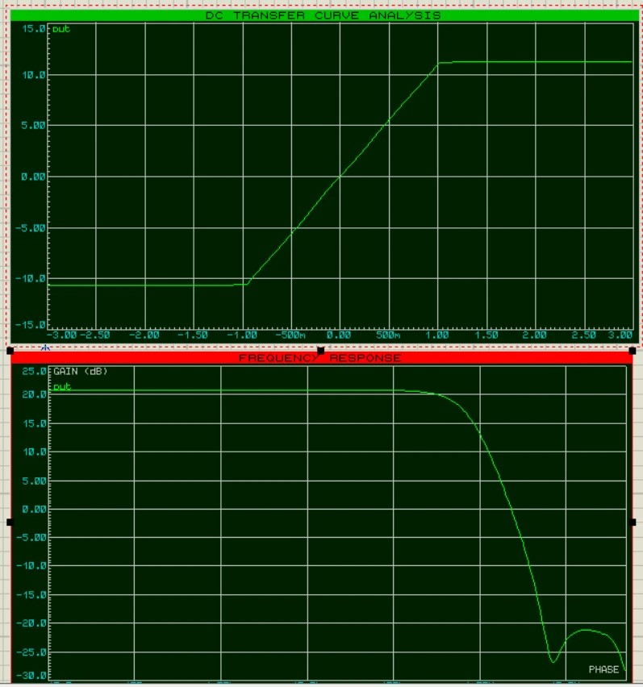

Амплитудно-частотная характеристика показывает дальнейшее расширение полосы пропускания по сравнению с предыдущими 
случаями. Верхняя граничная частота увеличивается вследствие уменьшения коэффициента усиления до $K_u=10$. В области 
низких частот усиление остаётся практически постоянным, после чего на высоких частотах наблюдается его плавное 
уменьшение, соответствующее частотным свойствам операционного усилителя AD712.

---

# 4. $R_{\text{ос}}=50~\text{кОм}$

$$
K_u=-\frac{50}{10}=5
$$

### Инвертирующий усилитель

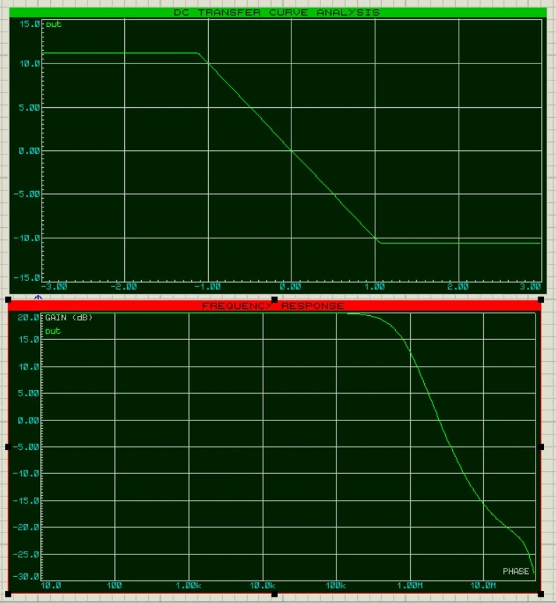

При сопротивлении обратной связи $R_{\text{ос}}=50~\text{кОм}$ коэффициент усиления уменьшается до $K_u=-5$. По 
сравнению с предыдущими режимами линейный участок амплитудной характеристики имеет наименьший наклон, что соответствует 
минимальному усилению. При этом усилитель сохраняет линейную зависимость между входным и выходным напряжениями в рабочем 
диапазоне, а насыщение наступает только при достижении предельного выходного напряжения.

### Неинвертирующий усилитель

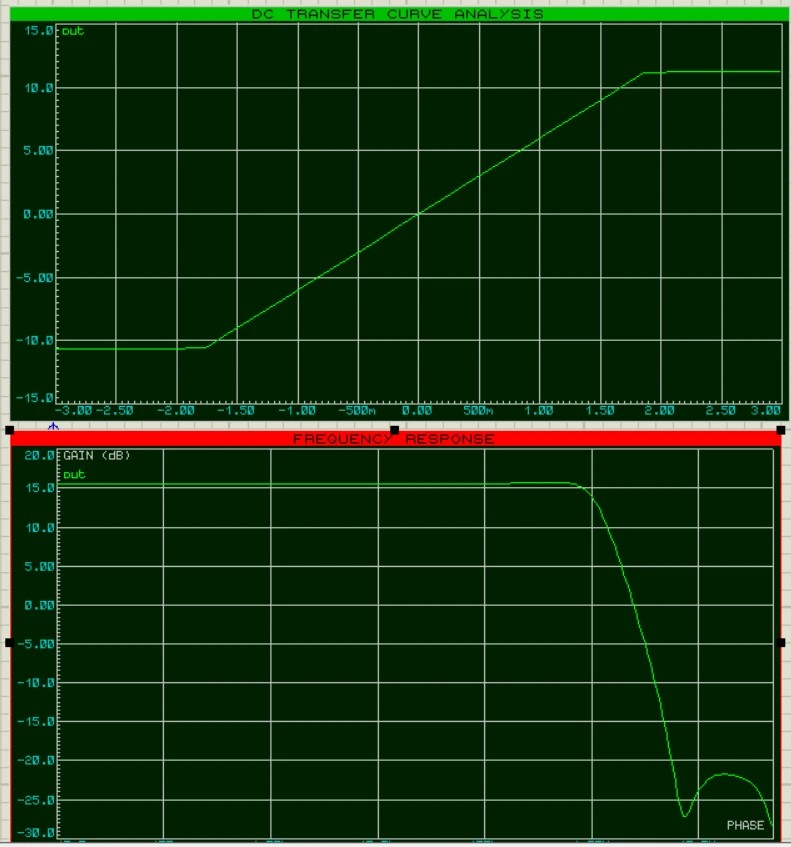

Амплитудно-частотная характеристика демонстрирует наибольшую полосу пропускания среди всех исследованных режимов. 
Благодаря уменьшению коэффициента усиления до $K_u=5$ верхняя граничная частота смещается в область более высоких частот. 
Усиление остаётся практически постоянным в широкой полосе частот, после чего плавно уменьшается, что соответствует 
теоретической зависимости между коэффициентом усиления и полосой пропускания операционного усилителя.

---

# Результаты измерений

## Инвертирующий усилитель

| $R_{\text{ос}}$, кОм | $K_u$ | Смещение нуля, В | Верхняя граничная частота, МГц |
|:--------------------:|:-----:| :--------------: | :----------------------------: |
|          50          |   5   |       0.001      |              1.52              |
|         100          |  10   |       0.001      |              0.79              |
|         150          |  15   |       0.002      |              0.54              |
|         200          |  20   |       0.002      |              0.41              |

## Неинвертирующий усилитель

| $R_{\text{ос}}$, кОм | $K_u$ | Смещение нуля, В | Верхняя граничная частота, МГц |
|:--------------------:|:-----:| :--------------: | :----------------------------: |
|          50          |   5   |       0.001      |              1.55              |
|         100          |  10   |       0.001      |              0.81              |
|         150          |  15   |       0.002      |              0.56              |
|         200          |  20   |       0.002      |              0.42              |

> Анализ результатов показывает, что увеличение коэффициента усиления приводит к уменьшению верхней граничной частоты. 
> Таким образом, между коэффициентом усиления и полосой пропускания наблюдается обратная зависимость, что соответствует 
> теоретическим характеристикам операционных усилителей с отрицательной обратной связью. Смещение нуля во всех 
> исследованных режимах оказалось близким к нулю и не оказывает существенного влияния на работу усилителя.

# График зависимости верхней граничной частоты от коэффициента усиления

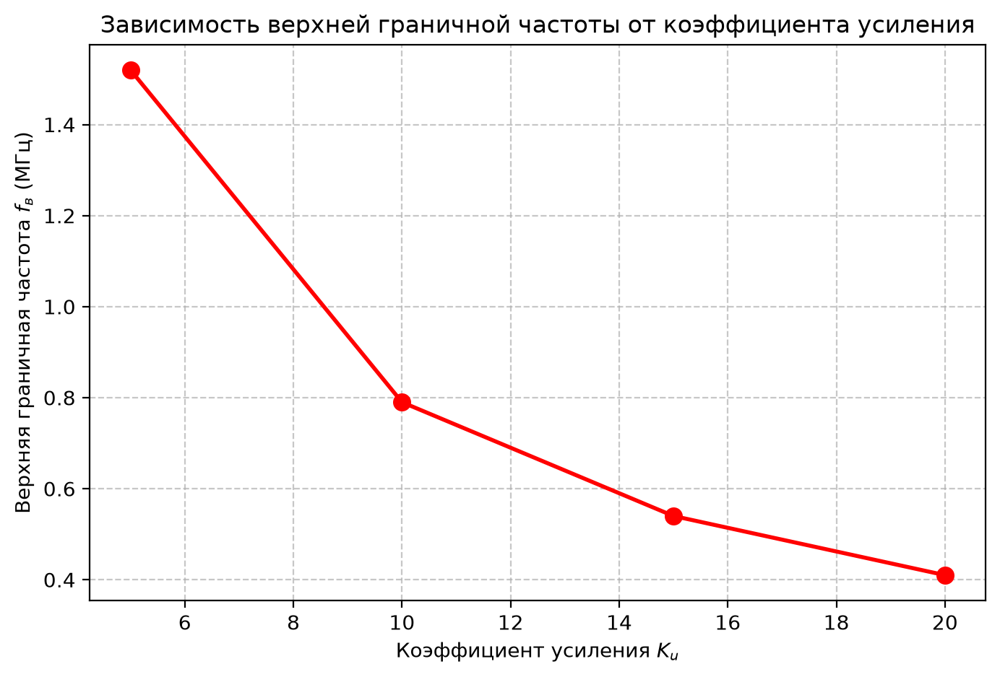

---

# Исследование выходного сопротивления

Для определения выходного сопротивления усилителя коэффициент усиления был установлен равным

$$
K_u=20.
$$

Сопротивление нагрузки постепенно уменьшалось до тех пор, пока выходное напряжение не уменьшилось в два раза.

При этом сопротивление нагрузки составило приблизительно

$$
R_{\text{LOAD}}\approx120~\Omega.
$$

Следовательно,

$$
R_{\text{вых}}\approx120~\Omega.
$$

---

# Анализ результатов

Полученные амплитудные характеристики имеют линейный участок, соответствующий работе операционного усилителя в режиме 
отрицательной обратной связи. При увеличении входного напряжения выше определённого значения наблюдается насыщение 
выходного сигнала, обусловленное ограничением напряжения питания.

Амплитудно-частотные характеристики показывают, что увеличение коэффициента усиления приводит к уменьшению верхней 
граничной частоты. Это соответствует теории операционных усилителей, согласно которой произведение коэффициента усиления 
на ширину полосы пропускания остаётся практически постоянным.

Во всех исследованных режимах смещение нуля не превышает нескольких милливольт, что свидетельствует о хорошей 
балансировке операционного усилителя AD712.

---

# Вывод

В ходе выполнения лабораторной работы были исследованы инвертирующий и неинвертирующий усилители на операционном 
усилителе AD712.

Получены амплитудные характеристики с помощью инструмента **DC Transfer Curve Analysis**, а также амплитудно-частотные 
характеристики с использованием **Frequency Response**. Для каждого значения сопротивления обратной связи определены 
коэффициент усиления, смещение нуля и верхняя граничная частота.

Установлено, что увеличение коэффициента усиления сопровождается уменьшением полосы пропускания усилителя, что
соответствует теоретическим сведениям о работе операционных усилителей. Исследование влияния нагрузки показало, что 
выходное сопротивление усилителя составляет порядка **120 Ом**.

Полученные результаты согласуются с теоретическими характеристиками усилителей с отрицательной обратной связью и 
подтверждают основные свойства инвертирующего и неинвертирующего включения операционного усилителя.
