# Работа №5: Исследование комбинационной логики

## Цель работы

Изучение характеристик и функций базовых логических элементов цифровых схем, а также комбинационной логики на их основе.

# Упражнение 1. Исследование базовых логических элементов цифровых интегральных микросхем

## Схема эксперимента

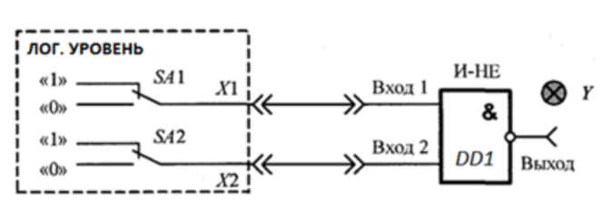

В данном упражнении исследуется работа базовых логических элементов:

- 2И-НЕ;
- 2И;
- 2ИЛИ-НЕ;
- НЕ.

---

## Таблица истинности логических элементов

| № | $X_1$ | $X_2$ | 2И-НЕ | 2И | 2ИЛИ-НЕ | НЕ |
|:--:|:--:|:--:|:--:|:--:|:--:|:--:|
| 1 | 0 | 0 | 1 | 0 | 1 | 1 |
| 2 | 1 | 0 | 1 | 0 | 0 | 0 |
| 3 | 0 | 1 | 1 | 0 | 0 | 1 |
| 4 | 1 | 1 | 0 | 1 | 0 | 0 |

---

## Исследование работы логических элементов с помощью осциллографа

### Осциллограмма для элемента 2И-НЕ

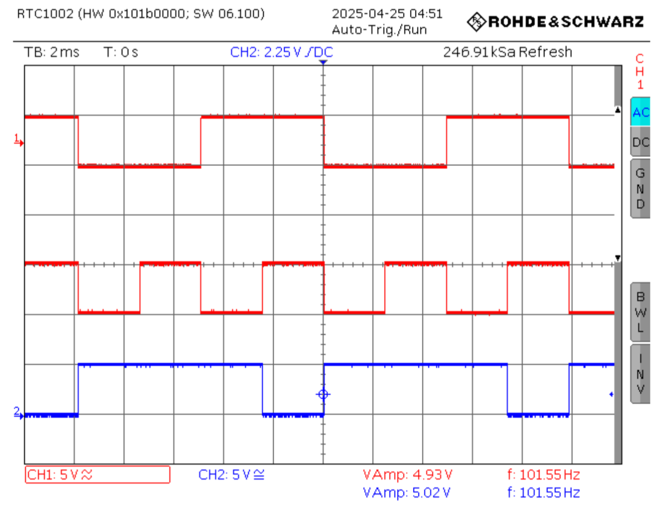

Элемент 2И-НЕ реализует операцию отрицания логического умножения. Его выход равен нулю только в том случае, если оба входа находятся в состоянии логической единицы.

Логическая функция:

$$
Q=\overline{X_1 \cdot X_2}
$$

---

### Осциллограмма для элемента 2И

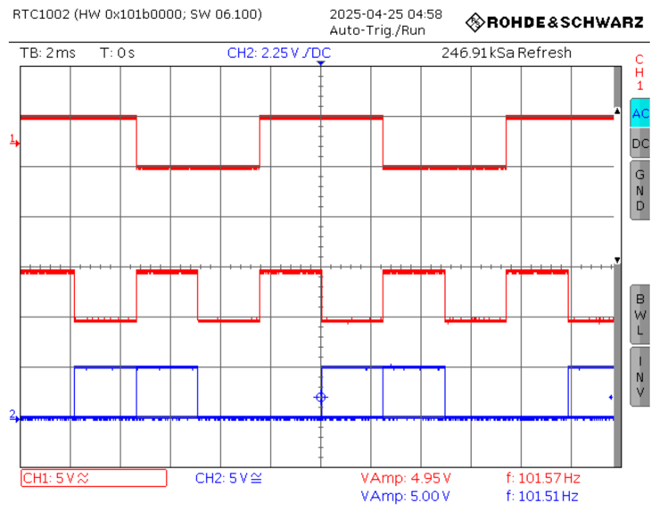

Элемент 2И реализует операцию логического умножения. Выходной сигнал равен единице только при одновременном наличии логической единицы на обоих входах.

Логическая функция:

$$
Q=X_1 \cdot X_2
$$

---

### Осциллограмма для элемента 2ИЛИ-НЕ

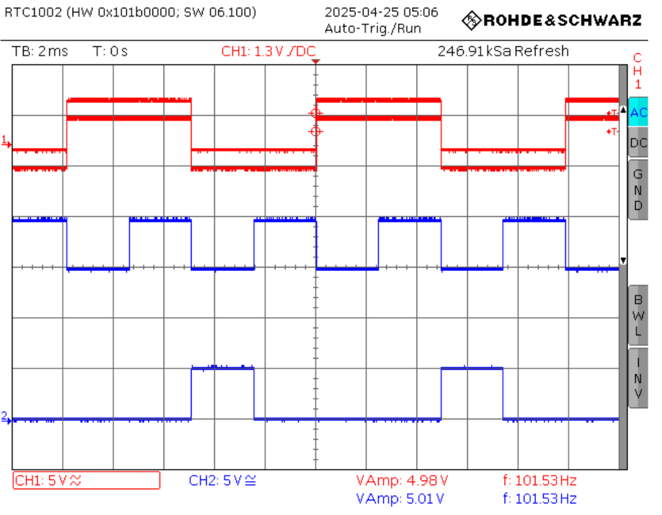

Элемент 2ИЛИ-НЕ реализует операцию отрицания логического сложения. Выходной сигнал равен единице только в том случае, если оба входных сигнала равны нулю.

Логическая функция:

$$
Q=\overline{X_1+X_2}
$$

---

### Осциллограмма для элемента НЕ

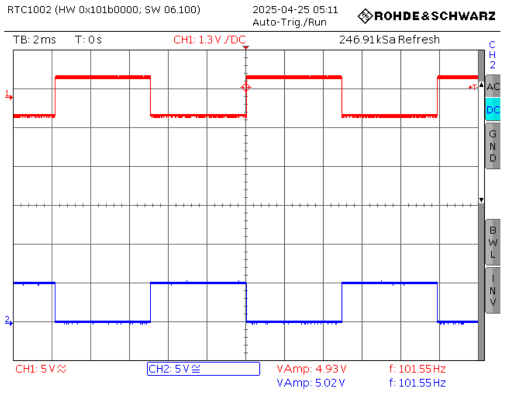

Элемент НЕ выполняет инверсию входного сигнала. Если на входе логический ноль, на выходе логическая единица, и наоборот.

Логическая функция:

$$
Q=\overline{X}
$$

---

## Вывод по упражнению 1

В ходе эксперимента были составлены таблицы истинности и исследованы осциллограммы базовых логических элементов.

Осциллограммы демонстрируют соответствие работы элементов их таблицам истинности. Для элемента 2И выходной сигнал появляется только при одновременном наличии логических единиц на обоих входах, то есть при $X_1=1$ и $X_2=1$.

Элемент 2И-НЕ даёт инвертированный результат относительно элемента 2И. Элемент 2ИЛИ-НЕ реализует инверсию результата операции ИЛИ. Элемент НЕ корректно инвертирует входной логический сигнал.

---

# Упражнение 2. Исследование временных характеристик логических элементов

## Схема эксперимента

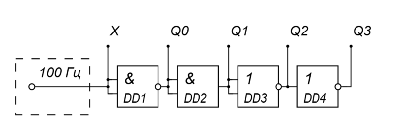

В данном упражнении исследуются временные характеристики логических элементов, а именно задержка распространения сигнала.

Задержка распространения — это время между изменением входного сигнала и соответствующим изменением выходного сигнала.

---

## Осциллограмма на выходе элемента 2И-НЕ

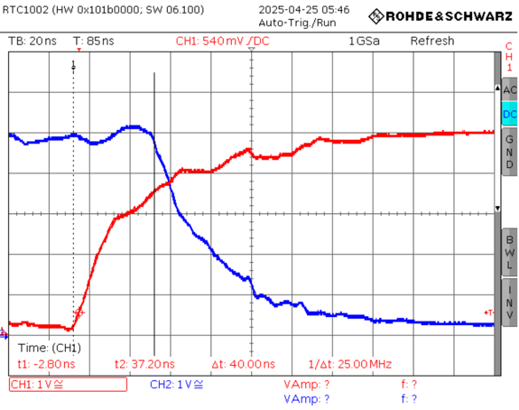

Задержка распространения:

$$
\Delta t = 40.00 \text{ нс}
$$

---

## Осциллограмма на выходе элемента 2ИЛИ-НЕ

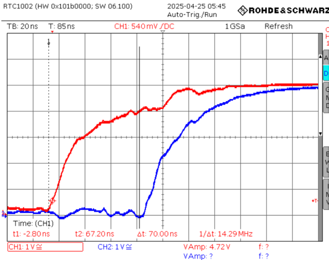

Задержка распространения:

$$
\Delta t = 70.00 \text{ нс}
$$

---

## Осциллограмма на выходе элемента 2И

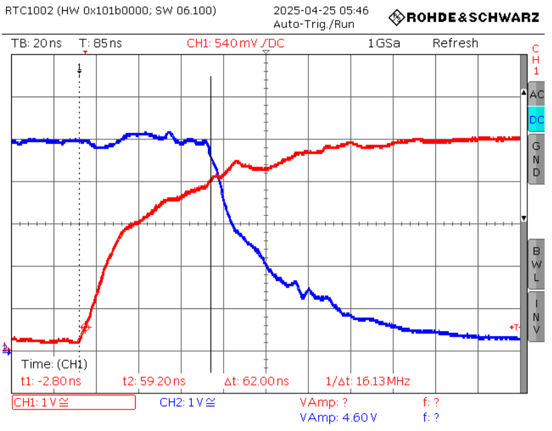

Задержка распространения:

$$
\Delta t = 62.00 \text{ нс}
$$

---

## Осциллограмма на выходе элемента НЕ

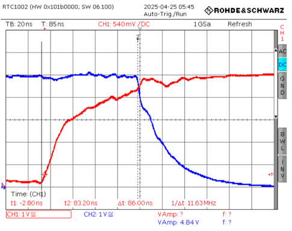

Задержка распространения:

$$
\Delta t = 86.00 \text{ нс}
$$

---

## Сводная таблица задержек распространения

| Логический элемент | Задержка распространения $\Delta t$, нс |
|:--|:--:|
| 2И-НЕ | 40.00 |
| 2ИЛИ-НЕ | 70.00 |
| 2И | 62.00 |
| НЕ | 86.00 |

---

## Вывод по упражнению 2

В ходе эксперимента были измерены задержки распространения сигналов в логических элементах 2И-НЕ, 2ИЛИ-НЕ, 2И и НЕ.

Полученные значения задержек показывают, что выходной сигнал изменяется не мгновенно, а спустя некоторое время после изменения входного сигнала. Это связано с конечным временем переключения транзисторов внутри цифровых интегральных микросхем.

Наименьшая измеренная задержка получена у элемента 2И-НЕ:

$$
\Delta t = 40.00 \text{ нс}
$$

Наибольшая измеренная задержка получена у элемента НЕ:

$$
\Delta t = 86.00 \text{ нс}
$$

---

# Упражнение 3. Исследование комбинационной схемы «Исключающее ИЛИ»

## Схема эксперимента

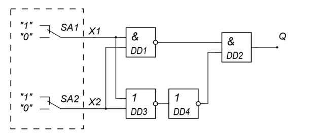

В данном упражнении исследуется комбинационная схема, реализующая логическую операцию «Исключающее ИЛИ».

Элемент «Исключающее ИЛИ» имеет логическую единицу на выходе тогда, когда входные сигналы различны.

Логическая функция:

$$
Q=X_1 \oplus X_2
$$

---

## Таблица истинности схемы «Исключающее ИЛИ»

| № | $X_1$ | $X_2$ | $Q$ |
|:--:|:--:|:--:|:--:|
| 1 | 0 | 0 | 0 |
| 2 | 1 | 0 | 1 |
| 3 | 0 | 1 | 1 |
| 4 | 1 | 1 | 0 |

---

## Вывод по упражнению 3

По результатам эксперимента установлено, что исследуемая схема корректно реализует операцию «Исключающее ИЛИ».

Выходной сигнал равен логической единице при различных входных сигналах:

$$
X_1 \neq X_2
$$

и равен логическому нулю при одинаковых входных сигналах:

$$
X_1 = X_2
$$

Таким образом, схема реагирует на различие входных логических уровней и соответствует таблице истинности элемента XOR.

---

# Упражнение 4. Исследование демультиплексора

## Схема эксперимента

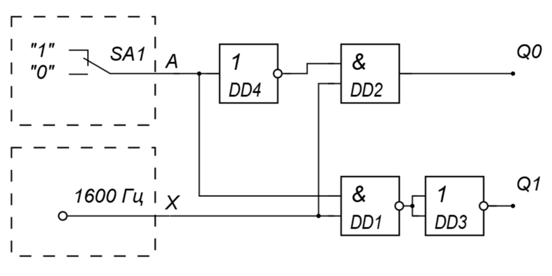

В данном упражнении исследуется работа демультиплексора.

Демультиплексор — это комбинационное устройство, которое направляет входной сигнал на один из выходов в зависимости от значения управляющего сигнала.

В данной схеме управляющий вход обозначен как $A$, а выходы — $Y_0$ и $Y_1$.

---

## Осциллограмма для $A=0$

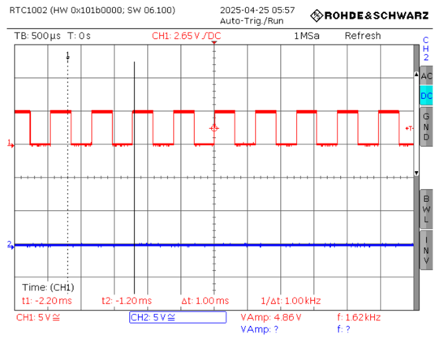

При значении управляющего сигнала:

$$
A=0
$$

входной сигнал передаётся на выход:

$$
Y_0
$$

На выходе $Y_1$ при этом наблюдается логический ноль.

---

## Осциллограмма для $A=1$

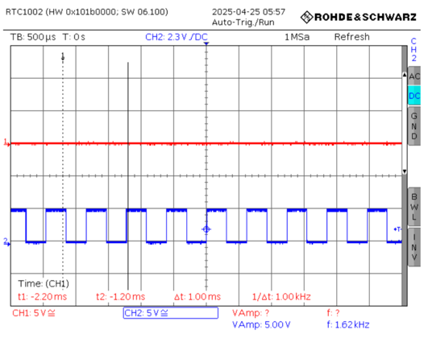

При значении управляющего сигнала:

$$
A=1
$$

входной сигнал передаётся на выход:

$$
Y_1
$$

На выходе $Y_0$ при этом наблюдается логический ноль.

---

## Результаты измерений

Амплитуда сигнала на выходах:

| Выход | Амплитуда сигнала, В |
|:--:|:--:|
| $Y_0$ | 4.86 |
| $Y_1$ | 5.00 |

Частота сигнала находилась в диапазоне:

$$
f \approx 1.00\text{–}1.62 \text{ кГц}
$$

---

## Вывод по упражнению 4

В ходе эксперимента была исследована работа демультиплексора. Было установлено, что схема корректно направляет входной сигнал на один из выходов в зависимости от значения управляющего сигнала $A$.

При:

$$
A=0
$$

сигнал поступает на выход $Y_0$.

При:

$$
A=1
$$

сигнал поступает на выход $Y_1$.

Амплитуда сигнала сохраняется на обоих активных выходах и составляет примерно:

$$
Y_0 = 4.86 \text{ В}
$$

$$
Y_1 = 5.00 \text{ В}
$$

На неактивном выходе наблюдается устойчивый логический ноль. Следовательно, исследуемая схема корректно выполняет функцию демультиплексирования.

---

# Общий вывод

В ходе лабораторной работы были изучены характеристики и функции базовых логических элементов цифровых схем, а также комбинационные схемы на их основе.

Были исследованы логические элементы:

- 2И-НЕ;
- 2И;
- 2ИЛИ-НЕ;
- НЕ.

Для каждого элемента были составлены таблицы истинности и получены осциллограммы, подтверждающие правильность их работы.

Также были измерены временные характеристики логических элементов. Было установлено, что каждый элемент имеет конечную 
задержку распространения сигнала, которая связана с физическими процессами переключения внутри интегральной микросхемы.

Комбинационная схема «Исключающее ИЛИ» корректно реализовала логическую функцию XOR: выходной сигнал равен единице 
только при различающихся входных сигналах.

Демультиплексор корректно направлял входной сигнал на выход $Y_0$ или $Y_1$ в зависимости от состояния управляющего 
входа $A$.

Таким образом, в работе были подтверждены основные свойства базовых логических элементов и комбинационных цифровых схем.
