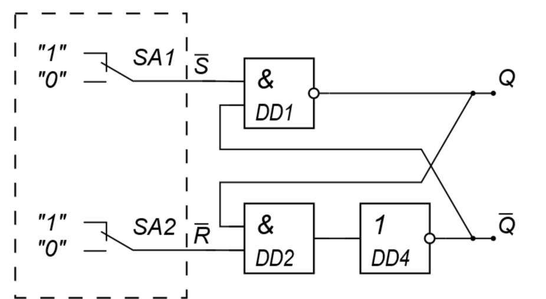
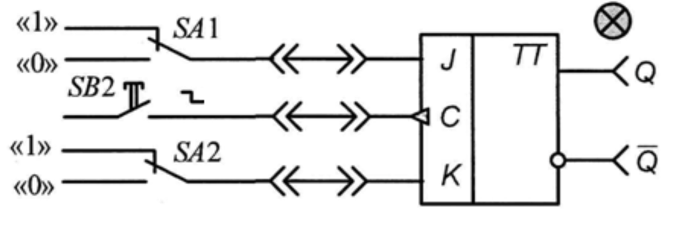
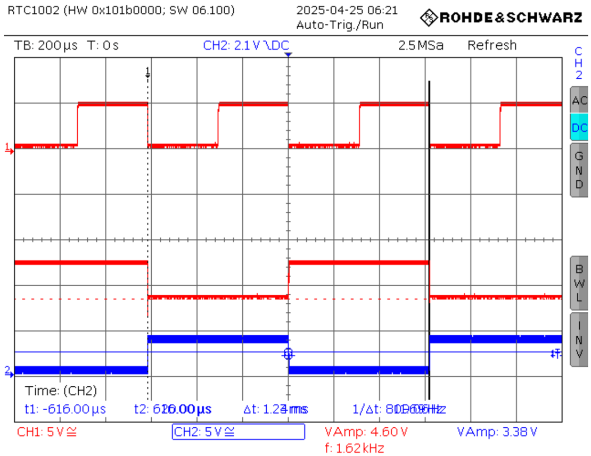
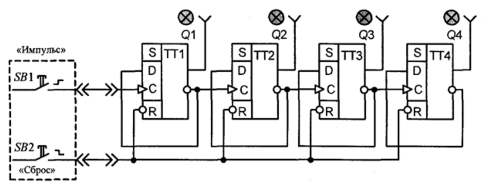
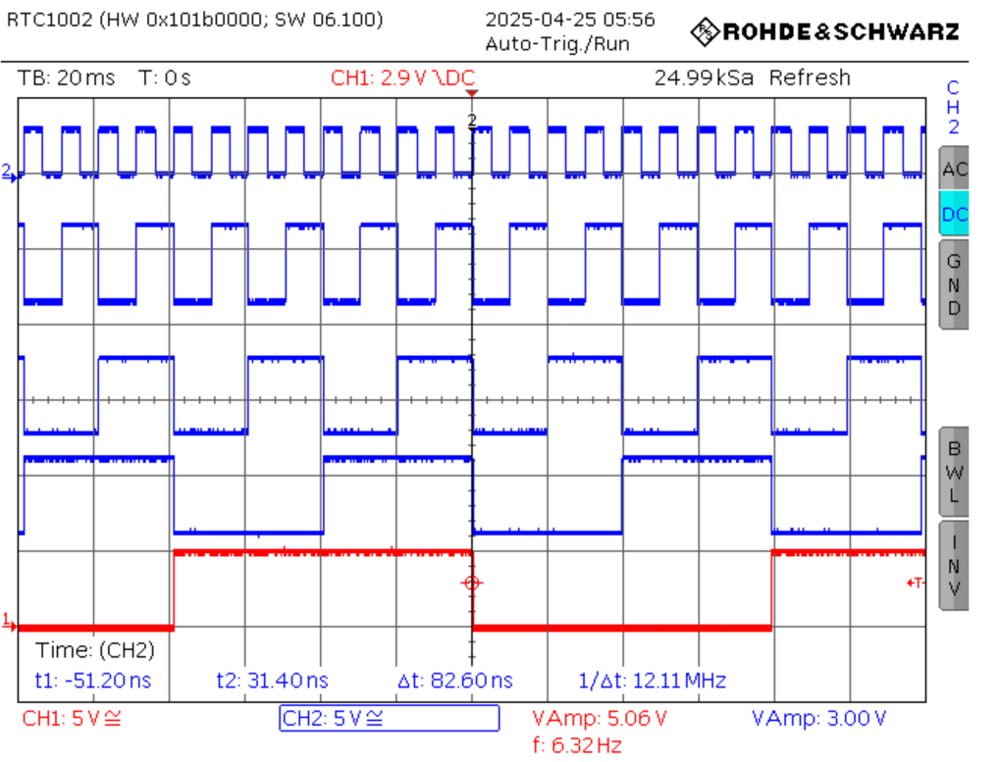

# Работа №6: Исследование последовательностной логики

## Цель работы

Изучение работы RS-триггера, JK-триггера и двоичного асинхронного суммирующего счётчика.


# Упражнение 1. Исследование асинхронного RS-триггера

## Схема эксперимента



В данном упражнении исследуется поведение асинхронного RS-триггера при различных комбинациях логических сигналов на входах управления.

Так как в схеме используются инверсные входы, входы обозначаются как:

- `S̅` — инверсный вход установки;
- `R̅` — инверсный вход сброса.

---

## Таблица состояний RS-триггера

| № | S̅ | R̅ | Q<sub>t-1</sub> | Q<sub>t</sub> | Q̅<sub>t</sub> |
|:--:|:--:|:--:|:--:|:--:|:--:|
| 1 | 0 | 1 | 1 | 1 | 0 |
| 2 | 1 | 1 | 1 | 1 | 0 |
| 3 | 1 | 0 | 1 | 0 | 1 |
| 4 | 1 | 1 | 0 | 0 | 1 |
| 5 | 0 | 1 | 0 | 1 | 0 |
| 6 | 1 | 1 | 1 | 1 | 0 |
| 7 | 0 | 0 | 0 | 1 | 1 |

---

## Анализ работы RS-триггера

При:

$$
S̅ = 0, R̅ = 1
$$

триггер устанавливается в единичное состояние:

$$
Q = 1, Q̅ = 0
$$

Это состояние не зависит от предыдущего состояния триггера.

При:

$$
S̅ = 1, R̅ = 0
$$

триггер сбрасывается:

$$
Q = 0, Q̅ = 1
$$

При:

$$
S̅ = 1, R̅ = 1
$$

триггер сохраняет предыдущее состояние:

$$
Q_t = Q_{t-1}
$$

При:

$$
S̅ = 0, R̅ = 0
$$

возникает запрещённое состояние. В этом режиме оба выхода могут принять одинаковое значение, что противоречит нормальной работе триггера, так как выходы `Q` и `Q̅` должны быть инверсными.

---

## Вывод по упражнению 1

В ходе исследования была проверена работа асинхронного RS-триггера с инверсными входами управления.

При `S̅ = 0, R̅ = 1` триггер устанавливается в состояние `Q = 1`.  
При `S̅ = 1, R̅ = 0` триггер сбрасывается в состояние `Q = 0`.  
При `S̅ = 1, R̅ = 1` триггер сохраняет предыдущее состояние.  
Комбинация `S̅ = 0, R̅ = 0` является запрещённой, так как приводит к неопределённому состоянию выходов.

Таким образом, RS-триггер выполняет функции хранения, установки и сброса одного бита информации.

---

# Упражнение 2. Исследование JK-триггера

## Схема эксперимента



JK-триггер является более универсальным триггером по сравнению с RS-триггером. Он имеет входы:

- `J` — вход установки;
- `K` — вход сброса;
- `C` — тактовый вход;
- `Q` и `Q̅` — прямой и инверсный выходы.

---

## 2.1. Составление таблицы истинности JK-триггера

| № | J | K | C | Q | Q̅ | Режим работы |
|:--:|:--:|:--:|:--:|:--:|:--:|:--|
| 1 | 1 | 0 | ↑ | 1 | 0 | Установка |
| 2 | 0 | 1 | ↑ | 0 | 1 | Сброс |
| 3 | 1 | 0 | ↑ | 1 | 0 | Установка |
| 4 | 1 | 1 | ↑ | 0 | 1 | Переключение |
| 5 | 1 | 1 | ↑ | 1 | 0 | Переключение |

Обозначение `↑` показывает, что изменение состояния происходит по активному фронту тактового сигнала.

---

## Основные режимы работы JK-триггера

| J | K | Состояние после такта |
|:--:|:--:|:--|
| 0 | 0 | Хранение предыдущего состояния |
| 0 | 1 | Сброс, `Q = 0` |
| 1 | 0 | Установка, `Q = 1` |
| 1 | 1 | Переключение в противоположное состояние |

---

## 2.2. Исследование JK-триггера в счётном режиме

В счётном режиме входы триггера находятся в состоянии:

```text
J = 1, K = 1
```

При такой комбинации входов JK-триггер меняет своё состояние на противоположное при каждом активном фронте тактового сигнала.

---

## Осциллограмма счётного режима JK-триггера



Масштабы осциллографа:

| Параметр | Значение |
|:--|:--:|
| Развёртка по времени | 200 мс/дел |
| Масштаб по оси Ox | 5 В/дел |
| Масштаб по оси Oy | 5 В/дел |

---

## Вывод по упражнению 2

В ходе эксперимента была исследована работа JK-триггера.

JK-триггер реагирует на комбинации входных сигналов `J` и `K`. При `J = 1, K = 0` триггер устанавливается в единичное 
состояние, при `J = 0, K = 1` — сбрасывается в нулевое состояние.

Особый интерес представляет режим:

```text
J = 1, K = 1
```

В этом режиме триггер переключает своё состояние на противоположное при каждом тактовом импульсе. Поэтому JK-триггер 
может использоваться в счётчиках и делителях частоты.

Осциллограмма подтверждает переключение состояния триггера под действием тактового сигнала. Возможное применение 
JK-триггера — схемы синхронизации, делители частоты и двоичные счётчики.

---

# Упражнение 3. Исследование асинхронного четырёхразрядного двоичного счётчика

## Схема эксперимента



В данном упражнении исследуется работа четырёхразрядного асинхронного двоичного суммирующего счётчика.

Счётчик имеет четыре выхода:

- `Q1` — младший разряд;
- `Q2`;
- `Q3`;
- `Q4` — старший разряд.

---

## 3.1. Таблица состояний асинхронного четырёхразрядного двоичного счётчика

| № импульса C | Q4 | Q3 | Q2 | Q1 | Двоичное число |
|:--:|:--:|:--:|:--:|:--:|:--:|
| 0 | 0 | 0 | 0 | 0 | 0000 |
| 1 | 0 | 0 | 0 | 1 | 0001 |
| 2 | 0 | 0 | 1 | 0 | 0010 |
| 3 | 0 | 0 | 1 | 1 | 0011 |
| 4 | 0 | 1 | 0 | 0 | 0100 |
| 5 | 0 | 1 | 0 | 1 | 0101 |
| 6 | 0 | 1 | 1 | 0 | 0110 |
| 7 | 0 | 1 | 1 | 1 | 0111 |
| 8 | 1 | 0 | 0 | 0 | 1000 |
| 9 | 1 | 0 | 0 | 1 | 1001 |
| 10 | 1 | 0 | 1 | 0 | 1010 |
| 11 | 1 | 0 | 1 | 1 | 1011 |
| 12 | 1 | 1 | 0 | 0 | 1100 |
| 13 | 1 | 1 | 0 | 1 | 1101 |
| 14 | 1 | 1 | 1 | 0 | 1110 |
| 15 | 1 | 1 | 1 | 1 | 1111 |
| 16 | 0 | 0 | 0 | 0 | 0000 |

---

## 3.2. Исследование работы счётчика с помощью осциллографа

## Осциллограмма четырёхразрядного двоичного счётчика



Масштабы осциллографа:

| Параметр | Значение |
|:--|:--:|
| Развёртка по времени | 1 с/дел |
| Масштаб по оси Ox | 5 В/дел |
| Масштаб по оси Oy | 5 В/дел |

---

## Анализ работы счётчика

Таблица состояний демонстрирует работу четырёхразрядного двоичного счётчика с асинхронным управлением.

Счётчик работает по модулю 16. Это означает, что он последовательно проходит состояния от:

```text
0000
```

до:

```text
1111
```

После шестнадцатого импульса происходит переполнение, и счётчик возвращается в исходное состояние:

```text
0000
```

Каждый входной импульс увеличивает состояние счётчика на единицу в двоичном коде.

Из таблицы видно:

- `Q1` меняет состояние на каждом входном импульсе;
- `Q2` меняет состояние в 2 раза реже;
- `Q3` меняет состояние в 4 раза реже;
- `Q4` меняет состояние в 8 раз реже.

Таким образом, каждый следующий разряд имеет частоту переключения в два раза меньше, чем предыдущий.

---

## Временные параметры

По осциллограмме была зафиксирована временная задержка между переключениями разрядов:

```text
Δt = 82.60 нс
```

Обратная величина задержки:

```text
f ≈ 12.11 МГц
```

Эта величина характеризует предельное быстродействие схемы и показывает, что при слишком высокой частоте входных импульсов асинхронный счётчик может работать некорректно из-за накопления задержек переключения.

---

## Вывод по упражнению 3

В ходе эксперимента был исследован асинхронный четырёхразрядный двоичный суммирующий счётчик.

Счётчик последовательно проходит 16 состояний от `0000` до `1111`, после чего возвращается в состояние `0000`. Следовательно, он работает по модулю 16.

На осциллограмме видно, что каждый следующий разряд переключается в два раза реже предыдущего:

- `Q1` переключается на каждом импульсе;
- `Q2` — через один импульс;
- `Q3` — через четыре импульса;
- `Q4` — через восемь импульсов.

Наличие задержки между переключениями разрядов подтверждает асинхронный принцип работы счётчика: каждый следующий триггер переключается после изменения состояния предыдущего.

---

# Общий вывод

В ходе лабораторной работы были исследованы элементы последовательностной логики: RS-триггер, JK-триггер и асинхронный четырёхразрядный двоичный счётчик.

RS-триггер выполняет функции установки, сброса и хранения состояния. Было установлено, что при использовании инверсных входов комбинация `S̅ = 0, R̅ = 0` является запрещённой, так как приводит к неопределённому состоянию выходов.

JK-триггер является универсальным триггером. Он может работать в режимах хранения, установки, сброса и переключения. При `J = 1, K = 1` триггер работает в счётном режиме, изменяя своё состояние на противоположное при каждом тактовом импульсе.

Асинхронный четырёхразрядный двоичный счётчик работает по модулю 16 и последовательно формирует двоичный код от `0000` до `1111`. После переполнения счётчик возвращается к начальному состоянию.

Таким образом, в работе были подтверждены основные свойства последовательностных цифровых устройств, применяемых для хранения информации, деления частоты и счёта импульсов.